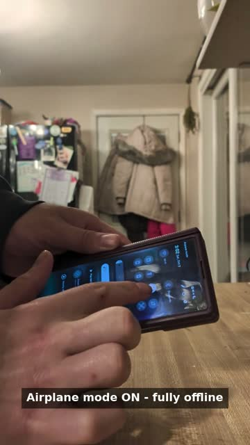

# Jarvis OS V2


A fully on-device voice assistant for Android. Wake-word activation, conversational barge-in, and a fully local speech pipeline. No cloud, no account, no per-token cost.

[](https://github.com/battlesbudz/Jarvis-OS-V2/blob/main/demo/jarvis-voice-demo.mp4)

*53-second demo: airplane mode on, phone locked, "Hey Jarvis," interrupted mid-answer. Click to watch.*

## How it works

```
mic → wake word → STT (Moonshine / Whisper) → Gemma E2B/E4B (LiteRT-LM) → TTS (Piper) → speaker
  ↳ barge-in: talk during playback and it stops, listens again, and redirects
```

## Measured performance

| Metric | Value |
|---|---|
| First-token latency (median) | 740 ms |
| Time to first spoken word (median) | 3.6 s |
| Generation speed (average) | 32.8 tokens/sec |
| Test setup | Hundreds of voice turns on a Galaxy Z Fold 6 |

## What it does

- **Wake-word activation** that works with the phone locked, the screen off, or another app in the foreground, built around Android's background microphone restrictions.
- **Conversational barge-in:** talk over a response and it stops playback, listens again, and redirects.
- **On-device pipeline:** local Gemma inference through LiteRT-LM, Moonshine/Whisper speech recognition, Piper speech synthesis.

## Status

Active development happens in the working branches ([see all branches](https://github.com/battlesbudz/Jarvis-OS-V2/branches)). The [latest release](https://github.com/battlesbudz/Jarvis-OS-V2/releases/latest) APK is the newest app build.

## Stack

- Kotlin and Jetpack Compose
- LiteRT-LM with Gemma (E2B/E4B) for conversation and reasoning
- Gemma E4B drives tool calling; Kotlin validates and executes typed actions
- No cloud backend required for the core assistant loop

## Try it

Grab the latest APK from [releases](https://github.com/battlesbudz/Jarvis-OS-V2/releases/latest) and install it on your phone. No account needed.

## Build from source

Clone the repo, open it in Android Studio, and build. Run on a physical device, the microphone pipeline needs real hardware.

## License

Source-available under the PolyForm Noncommercial License 1.0.0: free for personal, study, research, and other noncommercial use. Commercial use needs permission. See [LICENSE.md](LICENSE.md).
