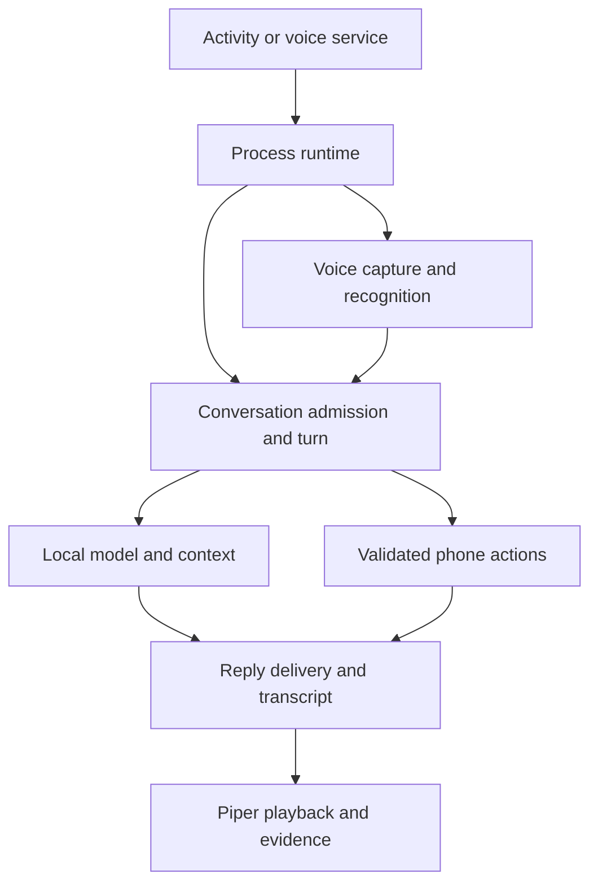

# Application architecture

This is the source navigation map for the current tree. Begin with
[development setup](development.md) to run it, or the [change guide](change-guide.md)
to find an owner and its tests. Packages below are relative to
`app/src/main/java/com/battlesbudz/jarvis/v2/`.

## Repository layout

| Path | Responsibility |
| --- | --- |
| `app/src/main/java/` | Kotlin/Java production code, organized by feature |
| `app/src/main/cpp/microwakeword/` | Wake/stop-keyword JNI and pinned microfrontend/interpreter build |
| `app/src/main/assets/`, `res/`, `AndroidManifest.xml` | Bundled supporting audio assets, UI/platform resources and Android entry points |
| `app/src/test/` | Host JVM policy, codec, persistence and state-machine regressions |
| `app/src/androidTest/` | Release instrumentation journeys with real Android adapters/UI/storage |
| `scripts/` | Native SDK preparation, packaging checks, build diagnostics and verification controllers |
| `.github/workflows/` | Signed builds, disposable Android verification and gated publication |
| `docs/` | Current navigation/contracts plus clearly dated plans and evidence |

`settings.gradle.kts` includes only `:app`. See [ADR 001](adr-001-package-boundaries.md)
for the decision to keep package/collaborator boundaries before adding build modules.

## Entry points and work ownership

| Owner | Lifetime and responsibility |
| --- | --- |
| `MainActivity` | Permissions, activity results, exports and attaching Compose; delegates feature work |
| `ui/JarvisApp` | UI state/callback wiring and selecting conversation/setup/history/diagnostic surfaces inside persistent Wisp chrome |
| `ui/WispPresence` / `WispPresenter` / `WispCharacter` | App-level observation, deterministic pose policy and native drawing; never owns or starts calls/actions |
| `presentation/AgentActivityMonitor` | Ephemeral turn/read leases and sequence-fenced public progress; safe tool metadata and terminal errors, never answer/reasoning tokens or operation authority |
| `JarvisAppComposition` | Compatibility composition adapter supplying only benchmark-store and call-evidence dependencies to UI |
| `JarvisRuntime.get(applicationContext)` | Process composition/lifecycle facade wiring typed owners/ports, shared history and compatibility entry adapters |
| `runtime/turn/VoiceTurnRunner` | Admits and orders typed voice stages, with fenced terminal errors/rearm policy; resource release belongs to finalizer |
| `voice/VoiceCallService` | User-started foreground microphone/playback eligibility, notification controls and wake lock |
| `voice/VideoCallService` / `VideoForegroundNotification` / `VideoNotificationLifecycle` / `CallVisionController` / `CameraXVideoBinder` | Call-scoped camera foreground eligibility, terminal notification publication/removal, capture generation, bounded cleanup and in-memory frames; independent of audio ownership |
| `voice/VoiceSessionController` | Call identity, transcript, delivered reply/action state and persisted call record |
| `work/ProcessConversationAdmission` | One shared atomic admission owner for conversation and model-file operations; `ConversationWork` is its compatibility view |
| `conversation/ConversationCoordinator` | Typed invocation admission, ordered stages and exact returned child-job cleanup; native resource release waits for this job |
| `voice/JarvisModelSetupWorker` | Foreground WorkManager download/setup surviving activity recreation and backgrounding |
| `memory/AndroidMemoryOs` | Process access to private SQLite memory/source storage and archive-expiry maintenance |

The foreground service starts runtime voice work; an activity recreation must not
create a second call or native engine. Accepted phone work has a process owner
separate from its speech delivery attempt. Downloads have a WorkManager owner
separate from model inference. These are distinct lifetimes, not separate assistants.

Video notification refreshes use the existing service token's three-argument
foreground route with the exact accepted startup type. `VideoForegroundNotification`
retains that type; specialUse never implies camera eligibility after a later grant.
This lets AMS admit the token and order its post/cancel work on the same handler;
a raw NMS notify could otherwise enqueue a protected foreground record after the
system cancellation. No refresh starts a new service or promotes foreground types.

Video shutdown revokes publication before camera cleanup, without holding its
publication lock during detach. Runtime update rejection revokes immediately,
then queues idempotent video-only cleanup on Main. All app-owned terminal stops
close before stopping; teardown runtime exceptions stay contained in the video
adapter. The service removes foreground state and explicitly cancels its exact
ID with a replacement-instance guard. Controller registry removal also checks
ownership. Failed detach retains its existing controller/binder cleanup state;
closed callbacks cannot publish and queued captures cannot enter after closure.
Android service lifecycle and final cancellation remain main-thread serialized.

## Main flow

Setup first resolves the selected catalog entry and installs verified files through
`ModelStore`/the worker. Text requests enter the shared conversation path directly.
Voice first acquires call resources, captures/recognizes final input, and enters
that same path; direct Gemma audio and diagnostic comparisons have explicit input
modes. A live ASR caption is not authority for an unfinished phone action. Eligible clean
ordinary native-Gemma capture can atomically retire an already-idle Whisper
caption stream without a new final decode; short, quiet, playback-tail-risk,
segmented and busy cases keep final ASR. The same serialized close returns its
one recognizer lease before authoritative reply-interruption probes. No detached
caption owner or endpoint-threshold change is introduced. See the
[idle-caption contract](../verification/idle-native-caption-finalization-2026-10-09.md).

A turn prepares bounded history, memory and references, chooses a validated action
or inference path, then publishes tokens/results through its delivery boundary.
Memory mutation fences can invalidate an in-flight answer. Phone success comes
from durable executor receipts. The phone pipeline publishes its durable RUNNING and
terminal journal boundaries for presentation; observation cannot authorize, block or retry an effect. Voice sends delivered text to Piper and records
playback evidence; unplayed generated text must not become heard conversation context.

## Feature packages

| Package | What it owns | Starting files |
| --- | --- | --- |
| `work/` | Shared process work admission without model storage depending on conversation implementation | `ProcessConversationAdmission` |
| `runtime/` | Process collaborators for journal, memory, accepted work and voice assembly/evidence | `PhoneTaskCoordinator`, `RuntimeMemoryCoordinator`, `AcceptedVoiceActionCoordinator`; [full map](../app-modularization.md) |
| `runtime/turn/` | Typed call stages, narrow dispatch/events/memory ports, explicit turn/model/input ownership and finalization | `VoiceTurnRunner`, `VoiceTurnStages`, `VoiceTurnLifetime`, `VoiceTurnFinalizer`; [lifetime map below](#voice-stage-and-lifetime-contracts) |
| `conversation/` | Per-turn routing, input/model execution, action bridge, reply publication and budgets | `ConversationCoordinator` (`ConversationRuntime.kt`), `ConversationContracts`, `ConversationModelSession`; [phase owners](../app-modularization.md) |
| `ai/` | Model catalog/compatibility, LiteRT adapters, prompt/context policies and supplied/network references | `ModelCatalog`, `ModelStore`, `LiteRtLmEngine`, `ConversationPromptBuilder`, `TurnOrchestrator` |
| `ai/storage/` | Download transport, hash/integrity and Android Downloads lookup | `ModelDownloader`, `ModelFileHash`, `DownloadedModelLookup` |
| `chat/` | Persistent threads, shared context and display/speech text formatting | `ConversationHistory`, `ShortTermConversationContext`, `AssistantText` |
| `voice/` | Capture/ASR, turn timing, wake/interruption, call resource leases, synthesis/playback and saved call evidence | `AudioTurnCapture`, `VoiceCallResources`, `VoiceSession`, `PiperVoiceOutput` |
| `voice/smartturn/` / `CaptureShadowObserver` / `SmartTurnBenchmarkTelemetry` | Explicit default-off local Smart Turn observations; one retained worker, bounded immutable PCM, generation/deadline fencing, metadata-only timing; capture-first follow-ups admitted only after the exact old reply successfully drains; never endpoint authority | `SmartTurnCallOwner`, `SmartTurnCaptureObserver`, `NativeSmartTurnBackend` |
| `ai/audio/` and native audio capture | Pinned local graph reconstruction, immutable artifact leases and bounded PCM-to-native worker; sealed inputs enter ordinary Conversation | `GemmaStreamingArtifactStore`, `WeightlessEncoderRecipe`, `RetainedPcmEncoderWorker`, `GemmaStreamingAudioCapture` |
| `voice/comparison/` | Explicit live comparison trial data; does not replace normal turn ownership | `LiveComparison` |
| `actions/` | Strict action contracts, complete plans, authority/approval, Android effects and durable journals | `ActionTurnPlan`, `ActionTurnRunner`, `JournaledActionPipeline`, `AndroidMobileActionExecutor` |
| `eval/` | Explicit local-model fixture checks through exclusive model admission and checked engine teardown; exact file/suite-bound reports; never Android side-effect dispatch | `ToolReliabilityBenchmark`, `LiteRtLmToolCallRunner`, `ToolReliabilityFixtures`, `ToolReliabilityScorer`, `ReliabilityReportStore` |
| `memory/` | Memory policy, reviewed facts, source archives, SQLite/migration, retrieval and delivery validity | `ConversationMemory`, `MemoryOs`, `SQLiteMemoryStore`, `MemoryDeliveryFence` |
| `diagnostics/` | Per-reply latency, production benchmark capture/journals/exports and bounded diagnostic evidence | `PipelineBenchmarks`, `ReplyCaptureBenchmark`, `PipelineBenchmarkCapture`, `AndroidPipelineBenchmarkStore`, `DiagnosticRecorder`, `ConversationMetricsExport`, `PipelineBenchmarkTextExport` |
| `presentation/` | Model setup operations through a narrow session port; durable download work identity | `ModelSetupOperations`, `ModelSetupContract` |
| `ui/` | Compose screens, model presentation, call overlay, attachments, task/memory panels and evidence exports | `JarvisApp`, `ModelSetupState`, `ModelSelectionSection`, `ConversationScreen`, `VoiceCallScreen`, `MemoryScreen`, `ConversationMetricsControls` |
| `assistant/` | Android default-assistant integration entry points | `JarvisInteractionService`, `JarvisRecognitionService` |

## Voice stage and lifetime contracts

`JarvisRuntime.runVoiceTurn` delegates to `VoiceTurnRunner.start`. A frozen
`VoiceTurnRequest` advances through `PreparedVoiceTurn` and `FinalizedVoiceTurn`;
intentional quiet/echo/control exits are typed terminal results. Live captions or
unfinished drafts do not authorize effects.

| Stage | Owner and boundary |
| --- | --- |
| Admit/sequence | `VoiceTurnRunner`: one active turn, typed queue claim, ordered stages, bounded error/rearm policy |
| Typed input | `TypedVoiceInputStage` and `VoiceTypedInputOwnership`: final queued message, exact native child and claim/terminal handoff |
| Prepare | `VoiceTurnPreparation`: acquire/reuse selected native/model/microphone/output/prefill/capture resources |
| Recognize | `VoiceTurnRecognition`: endpoint, echo, captions and controls become final recognition/audio/action evidence |
| Accepted follow-up | `AcceptedVoiceFollowupStage`: bounded capture/report pump; process `AcceptedVoiceActionCoordinator` retains the accepted tasks |
| Ordinary reply | `OrdinaryVoiceReplyStage`: frozen conversation dispatch, valid-memory token/TTS delivery and final direct-audio caption update |
| Finalize | `VoiceTurnFinalizer`: NonCancellable stop/close/join sequence for exact capture/prefill/speech children, then release resources and lease |
| Observe | `VoiceTurnObservation`/`VoiceTurnTelemetry`: benchmark/trace/actual playback evidence without request authority |

| Lifetime/port | Ownership contract |
| --- | --- |
| `VoiceCallState`/`VoiceCallAccess`/`VoiceCallEvents` | Shared call identity/control state and platform/UI events; not a bag of process services |
| `VoiceTurnLifetime` | Exact child/resource handles of one Default-dispatcher turn; no other turn's children may be released |
| `AcceptedFollowupLifetime`/`AcceptedReportPlayback` | Exact accepted-pump listener, selector and report children; NonCancellable stop/join/release/identity-detach before outer microphone/model cleanup; excludes the process phone worker |
| `VoiceTurnModelLease` | Transfer the same operation lease to accepted work and prevent double release |
| `VoiceConversationAccess`/`VoiceConversationDispatch` | Typed conversation invocation, current child and reset operations; returned child must join before model release |
| `ConversationSessionState` | Shared resident native engine/context accounting under the one model lease |
| `VoiceMemoryAccess`/`VoiceMemoryDeliveryOwner` | Capture/fence authority and immutable answer bindings using turn-local references/CAS; mutation invalidates delivery |

The call survives display navigation and speech interruption. Accepted task work
survives its speech attempt; explicit end detaches call audio according to the
existing cancellation contract. Cleanup joins native/speech borrowers before
releasing the owner and before rearming another turn. See the [audit](repository-audit.md)
for why acoustic capture and the follow-up/report state machine remain cohesive.

## Conversation stage contracts

`CheckedConversationLifecycle` owns the exact Conversation or legacy Session
child of `LiteRtLmEngine`. Terminal callbacks are observations; checked native
drain precedes reuse or destruction. Failed drain retains the native owners and
a process admission reservation. `NativeVoiceQuarantine` likewise retains a
failed encoder and its model-operation lease rather than rearming another turn.
Neither quarantine automatically retries an action or trusts provisional history.

For the exact pinned E2B ordinary direct-audio path, `RetainedPcmObserver` emits
accepted pre-roll once and retained PCM chunks once. A bounded dedicated worker
owns native encoder calls; discarded candidates get fresh owners. Capture joins,
complete PCM count/hash and native output counts gate immutable sealed content.
The encoder closes before Conversation prefill. Static comparison trials and
previously recorded corrections keep their raw-audio path; Piper-overlap encoder
capture remains a separate gate. Clean-pause native answer speculation uses the
explicit frozen-input contract below; undecidable captures retain this joined path.

`NativeVoiceSpeculation` and `SpeculativeResponseCoordinator` own a bounded,
effect-free native pause draft under that same turn/model lease. Capture provides
an explicit frozen boundary and a joined raw-coverage certificate; the complete
original WAV remains the fallback. The encoder checked-closes before draft
Conversation inference. Exact final prompt/input matching releases held tokens
through ordinary Conversation filters; any required memory/history/native reset
first invalidates and drains the draft. `NativeSpeculativeAudioDriver` owns this
encoder-to-Conversation sequence. No speculative TTS, action, history or memory
publication occurs. See [native speculative response](../native-speculative-response.md)
for bounds, fallback/quarantine and unmeasured device latency acceptance.

The owner also records the first accepted nonempty PCM and each successful,
validated encoder step under its existing candidate gate. A bounded immutable
timing snapshot crosses JNI; it grants no request authority. After seal and
checked close, `NativeAudioCaptureTiming` binds the final snapshot to the capture
endpoint and retained pre-roll count. `VoiceTurnTelemetry` joins that observation
to the first answer playback-head event. `NativeAudioTimingMetrics` persists only
relative clock intervals and counts. Mapping uses a declared AOSP API30–36 source
family assumption plus runtime brackets; it does not attest an installed OEM
binary. Unknown clocks and discarded candidates cannot produce mapped timing.

For ASR text prefill, `ConversationPromptBuilder` uses one exact voice prefix for
both partial and final submission. Final-request memory, continuity and capture
context follow the completed current message as quoted evidence. This preserves
valid prefix KV while retaining the memory publication fence and rebuilding on
actual policy, history or transcript mismatch.

`ConversationCoordinator.start` accepts `ConversationInvocation` and
`ConversationCallbacks`. It owns shared admission and the exact returned child job;
call-owned model release must wait for that job to finish. Stages receive explicit
inputs and narrow collaborators, not the process runtime.

| Stage | Owner and boundary |
| --- | --- |
| Route | `ConversationRouting`: complete literal actions, status and integrity before memory/lookup; returns `RoutedConversation` or a terminal reply |
| Context | `ConversationContextPreparation`: approved memory snapshot, cutoff/capture/recall and reference context; returns `PreparedConversation` |
| Session/prompt | `ConversationModelSession`: resident engine/context budget and bounded summary; `ConversationPrompt`: assembled prompt/compaction policy |
| Generate | `ConversationGeneration`: selected multimodal input, safe stream/draft and strict native-tool receipt compatibility; returns `ConversationDraft` |
| Recover | `ConversationRecovery`: bounded read-only factuality/reference/repetition work; cannot admit phone effects |
| Finalize/publish | `ConversationFinalizer`: receipt-first visible text policy; `ConversationReply`: memory-valid token/completion, latency and benchmark finalization |
| Public activity | `ConversationActivity`: admitted-turn, bounded public progress sentences; no model inference, private reasoning or operation authority |
| Observe | `ConversationInferenceTelemetry`: exact submissions/progress; `ConversationBackend`: the resident LiteRT inference adapter |

`ConversationSessionState` shares only the resident engine, context-seeded flag and
character accounting between owners. `ConversationMemoryAccess`,
`ConversationReferences`, diagnostic callbacks and the backend expose their
respective authority. Source review and focused prompt/reply/session/recovery/finalizer
tests supplement the complete existing action/memory/voice suites.

## Persistence and compatibility

| Data | Production owner/storage |
| --- | --- |
| Installed language models | `ModelStore`; private `filesDir/models`, selection/integrity in `model_setup` preferences |
| Native model caches | Model-specific private cache paths; not the canonical installed model |
| Conversation threads | `ConversationHistory`; `conversations` preferences |
| Session selection/context token | Runtime/model owners; `chat_session`/`model_setup` preferences |
| Call transcript/playback/task status | `VoiceCallStore` and conversation projection; `voice_calls` preferences |
| Approved/pending facts, source text, erase/migration state | `SQLiteMemoryStore`; `noBackupFilesDir/memory-os.db`, validated legacy JSON migration |
| Durable phone attempts and groups | `FileToolTaskStore`; `noBackupFilesDir/phone-action-attempts.json` |
| Benchmark evidence | `AndroidPipelineBenchmarkStore`; `noBackupFilesDir/pipeline-benchmarks-v2`, legacy v1 archive |

Keep schema, filenames, serialized identities and preference keys stable during
refactors. The app disables Android backup; uninstall/clear-data removes device-local
content. Tests should use disposable data and preserve migration/unknown-outcome behavior.

The SDK-free `scripts/check_architecture.py` guard rejects process/runtime access
outside explicit composition entry points and conversation implementation coupling
in model code. Review still verifies port breadth, lifetime and typed data contracts;
the guard is not a Kotlin parser or proof of an acyclic package graph.

[Native/build details](development.md#native-and-release-boundaries),
[change guide](change-guide.md), [verification](../verification/README.md).

## Integrated Muse tools and workflows

The audio branch includes Muse `9f965badaeab20dcd5973ddb7d55d5846f64ca3c`.
`runtime/WorkflowCoordinator` owns reminder/workflow/provider composition;
`actions/WorkflowScheduleReceiver` is an Android alarm/reboot entry point that
enters that coordinator through the process runtime. `PhoneTaskCoordinator`
retains phone admission, exact screen approval and task-progress projection.
`ScreenControlService` owns the accessibility bridge and explicit screen session;
content-generation checks invalidate stale approvals. `ToolSourceAccess` enforces
persisted source denials, revocations and bounded scopes across dispatch adapters.

The common `FileToolTaskStore` reads schemas 1–3 and writes schema 3, preserving
workflow definitions, occurrences, resume progress, source permissions and receipts.
Unknown journal content fails closed rather than being reset or downgraded.
Submitted/unobserved app launches retain UNKNOWN_OUTCOME and cannot advance
success-dependent steps. Wisp observation remains read-only and cannot authorize
a phone action or extend an approval.

The streaming artifact store uses packaging-safe literal asset names and one
bounded transfer/hash verifier for installation and release asset admission.
The installed-APK check additionally verifies the audited gzip payload decodes
to the exact bounded structural stream. Final signed APK verification repeats
these identities; source-file presence is insufficient.

`VoiceSessionUi` retains a conversation-bound terminal failure independently of
the transient voice overlay. `ConversationScreen` exposes dismissal after call
teardown; a new explicit attempt clears the corresponding conversation's prior
failure. This state is in memory, not persisted across process restart.
`VoiceTurnPreparation.beginOwnedCall` registers the newly created call under the
controller monitor even when its first checkpoint throws. The turn runner's
existing lifetime/finalizer owns cleanup and fences late error publication by
call and turn-job identity.

Wisp presentation keeps task body/props separate from the real call audio owner.
`WispPresenter` chooses only observed states; `WispMotion` contains pure bounded
one-shot and mouth geometry policy, while `WispReceptionTracker` fences transient
admission nods by conversation/operation identity. `WispPresence` owns their
UI-local lifetimes and `WispCharacter` draws them. These collaborators cannot
start/approve/retry work, synthesize audio, persist state or change playback timing.

### Benchmark sharing boundary

`PipelineBenchmarkTextExport` renders every retained attempt in the selected
conversation/call scope, with provenance and completed-turn distributions only
inside comparable groups. Its numbered UTF-8 clipboard parts are lossless and
bounded; full JSON/CSV keep their existing schemas. `BenchmarkExportControls`
owns a frozen export and picker/copy state; `BenchmarkExportFiles` owns only
UTF-8 ContentResolver/FileProvider transport, MIME types and unique filenames.
These components cannot start model work or change retained measurements.

`voice/NativePauseCapture` owns the optional immutable frozen-prefix proposal and
raw completed-frame coverage certificate, distinct from the complete recording
owned by `AudioTurnCapture`. `NativePauseEndpointPolicy` and the completed-caption
cue tracker own only guarded native endpoint eligibility; they cannot publish
responses or alter speech/latency clocks. `CaptureSpeechQueue` forwards raw VAD
before noise gating so weak continuation revokes speculation immediately. The
[contract](../verification/native-frozen-pause-capture-2026-10-09.md) documents the
full-WAV fallback, spent-encoder fence and conservative unresolved-frame fallback.

## Capture-first reply handoff (review candidate)

`CaptureFirstAudioInput` owns a single retained raw borrower and bounded,
sequence-preserving transfer between reply and ordinary logical readers.
`CaptureFirstReplyHandoff` orders explicit successful playback, raw transfer,
old-listener join, new ordinary capture and sealed-input release. The optional
`PostAnswerCaptionContinuation` retains the exact Gemma child and checked reset.
`CaptionInputAdmission` and `CaptionPublicationFence` separate accepted-input
revocation from pending playback-tail verdicts; `CallInputQueue` and
`VoiceSessionController` hold exact publication authority. `VoiceCaptureHandoff`
seals one immutable next-input identity/PCM digest. `FinalWhisperFarewellSnapshot`
is a value-only, once-observed control check with no recognition work authority.
Raw ingress holds are sequence/coverage-aware and independent of retained-candidate
verdicts. Publication claims remain revocable until a short exact call-state commit;
checkpoint and immutable-source memory effects run outside ingress locks. A pure
optional final-candidate verdict hook reuses capture's existing reset path so echo
rejection cannot strand an unclassified raw tail after stopping the reader.
See the [repair ownership and review gates](../verification/capture-first-rearm-repair-2026-10-09.md).
