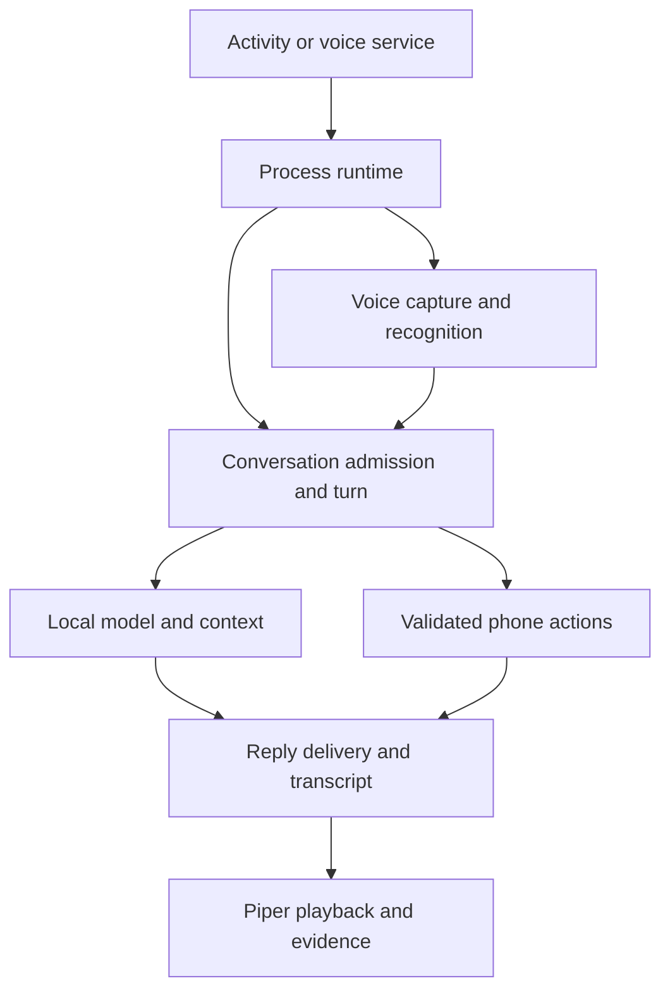

# Application architecture

This is the source navigation map for the current tree. Begin with
[development setup](development.md) to run it, or the [change guide](change-guide.md)
to find an owner and its tests. Packages below are relative to
`app/src/main/java/com/battlesbudz/jarvis/v2/`.

## Repository layout

| Path | Responsibility |
| --- | --- |
| `app/src/main/java/` | Kotlin/Java production code, organized by feature |
| `app/src/main/cpp/microwakeword/` | Wake/stop-keyword JNI and pinned microfrontend/interpreter build |
| `app/src/main/assets/`, `res/`, `AndroidManifest.xml` | Bundled supporting audio assets, UI/platform resources and Android entry points |
| `app/src/test/` | Host JVM policy, codec, persistence and state-machine regressions |
| `app/src/androidTest/` | Release instrumentation journeys with real Android adapters/UI/storage |
| `scripts/` | Native SDK preparation, packaging checks, build diagnostics and verification controllers |
| `.github/workflows/` | Signed builds, disposable Android verification and gated publication |
| `docs/` | Current navigation/contracts plus clearly dated plans and evidence |

`settings.gradle.kts` includes only `:app`. See [ADR 001](adr-001-package-boundaries.md)
for the decision to keep package/collaborator boundaries before adding build modules.

## Entry points and work ownership

| Owner | Lifetime and responsibility |
| --- | --- |
| `MainActivity` | Permissions, activity results, exports and attaching Compose; delegates feature work |
| `ui/JarvisApp` | UI state/callback wiring and selecting conversation/setup/history/diagnostic surfaces |
| `JarvisRuntime.get(applicationContext)` | One process runtime: conversation/model owner, shared history, call coordination and feature collaborators |
| `voice/VoiceCallService` | User-started foreground microphone/playback eligibility, notification controls and wake lock |
| `voice/VoiceSessionController` | Call identity, transcript, delivered reply/action state and persisted call record |
| `conversation/ConversationWork` | One conversation admission boundary shared by text and final voice requests |
| `voice/JarvisModelSetupWorker` | Foreground WorkManager download/setup surviving activity recreation and backgrounding |
| `memory/AndroidMemoryOs` | Process access to private SQLite memory/source storage and archive-expiry maintenance |

The foreground service starts runtime voice work; an activity recreation must not
create a second call or native engine. Accepted phone work has a process owner
separate from its speech delivery attempt. Downloads have a WorkManager owner
separate from model inference. These are distinct lifetimes, not separate assistants.

## Main flow

Setup first resolves the selected catalog entry and installs verified files through
`ModelStore`/the worker. Text requests enter the shared conversation path directly.
Voice first acquires call resources, captures/recognizes final input, and enters
that same path; direct Gemma audio and diagnostic comparisons have explicit input
modes. A live ASR caption is not authority for an unfinished phone action.

A turn prepares bounded history, memory and references, chooses a validated action
or inference path, then publishes tokens/results through its delivery boundary.
Memory mutation fences can invalidate an in-flight answer. Phone success comes
from durable executor receipts. Voice sends delivered text to Piper and records
playback evidence; unplayed generated text must not become heard conversation context.

## Feature packages

| Package | What it owns | Starting files |
| --- | --- | --- |
| `runtime/` | Process/call collaborators for journal, memory, accepted work and voice assembly/evidence | `PhoneTaskCoordinator`, `RuntimeMemoryCoordinator`, `AcceptedVoiceActionCoordinator`; [full map](../app-modularization.md) |
| `conversation/` | Per-turn routing, input/model execution, action bridge, reply publication and budgets | `ConversationRuntime`, `ConversationPolicy`, `ConversationWork`; [phase owners](../app-modularization.md) |
| `ai/` | Model catalog/compatibility, LiteRT adapters, prompt/context policies and supplied/network references | `ModelCatalog`, `ModelStore`, `LiteRtLmEngine`, `ConversationPromptBuilder`, `TurnOrchestrator` |
| `ai/storage/` | Download transport, hash/integrity and Android Downloads lookup | `ModelDownloader`, `ModelFileHash`, `DownloadedModelLookup` |
| `chat/` | Persistent threads, shared context and display/speech text formatting | `ConversationHistory`, `ShortTermConversationContext`, `AssistantText` |
| `voice/` | Capture/ASR, turn timing, wake/interruption, call resource leases, synthesis/playback and saved call evidence | `AudioTurnCapture`, `VoiceCallResources`, `VoiceSession`, `PiperVoiceOutput` |
| `voice/comparison/` | Explicit live comparison trial data; does not replace normal turn ownership | `LiveComparison` |
| `actions/` | Strict action contracts, complete plans, authority/approval, Android effects and durable journals | `ActionTurnPlan`, `ActionTurnRunner`, `JournaledActionPipeline`, `AndroidMobileActionExecutor` |
| `memory/` | Memory policy, reviewed facts, source archives, SQLite/migration, retrieval and delivery validity | `ConversationMemory`, `MemoryOs`, `SQLiteMemoryStore`, `MemoryDeliveryFence` |
| `diagnostics/` | Per-reply latency, production benchmark capture/journals/exports and bounded diagnostic evidence | `PipelineBenchmarkCapture`, `AndroidPipelineBenchmarkStore`, `DiagnosticRecorder` |
| `presentation/` | Model setup operations through a narrow session port; durable download work identity | `ModelSetupOperations`, `ModelSetupContract` |
| `ui/` | Compose screens, model presentation, call overlay, attachments, task/memory panels and evidence exports | `JarvisApp`, `ModelSetupState`, `ModelSelectionSection`, `ConversationScreen`, `VoiceCallScreen`, `MemoryScreen` |
| `assistant/` | Android default-assistant integration entry points | `JarvisInteractionService`, `JarvisRecognitionService` |

## Persistence and compatibility

| Data | Production owner/storage |
| --- | --- |
| Installed language models | `ModelStore`; private `filesDir/models`, selection/integrity in `model_setup` preferences |
| Native model caches | Model-specific private cache paths; not the canonical installed model |
| Conversation threads | `ConversationHistory`; `conversations` preferences |
| Session selection/context token | Runtime/model owners; `chat_session`/`model_setup` preferences |
| Call transcript/playback/task status | `VoiceCallStore` and conversation projection; `voice_calls` preferences |
| Approved/pending facts, source text, erase/migration state | `SQLiteMemoryStore`; `noBackupFilesDir/memory-os.db`, validated legacy JSON migration |
| Durable phone attempts and groups | `FileToolTaskStore`; `noBackupFilesDir/phone-action-attempts.json` |
| Benchmark evidence | `AndroidPipelineBenchmarkStore`; `noBackupFilesDir/pipeline-benchmarks-v2`, legacy v1 archive |

Keep schema, filenames, serialized identities and preference keys stable during
refactors. The app disables Android backup; uninstall/clear-data removes device-local
content. Tests should use disposable data and preserve migration/unknown-outcome behavior.

[Native/build details](development.md#native-and-release-boundaries),
[change guide](change-guide.md), [verification](../verification/README.md).
