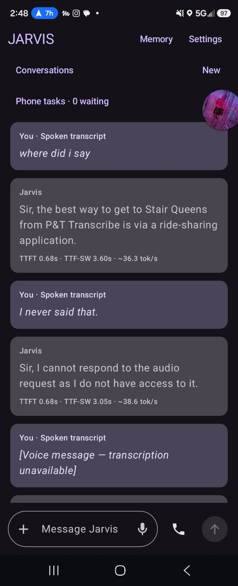
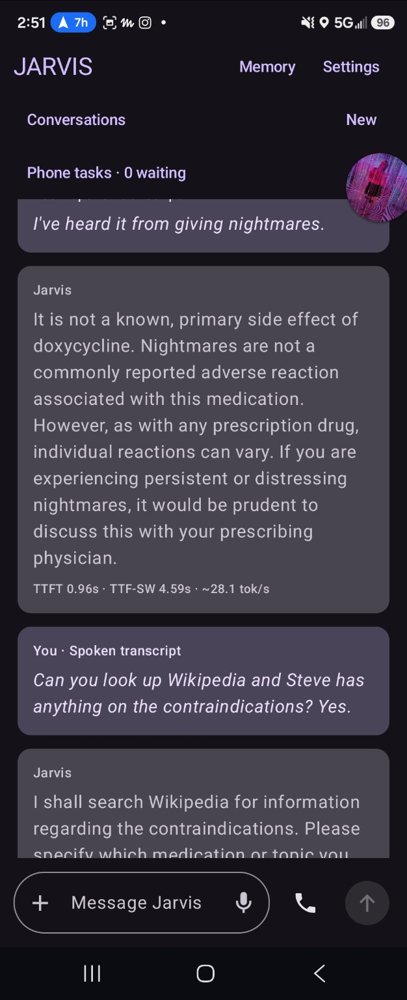
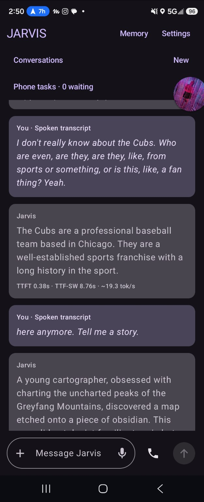
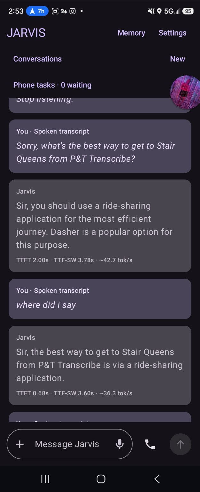
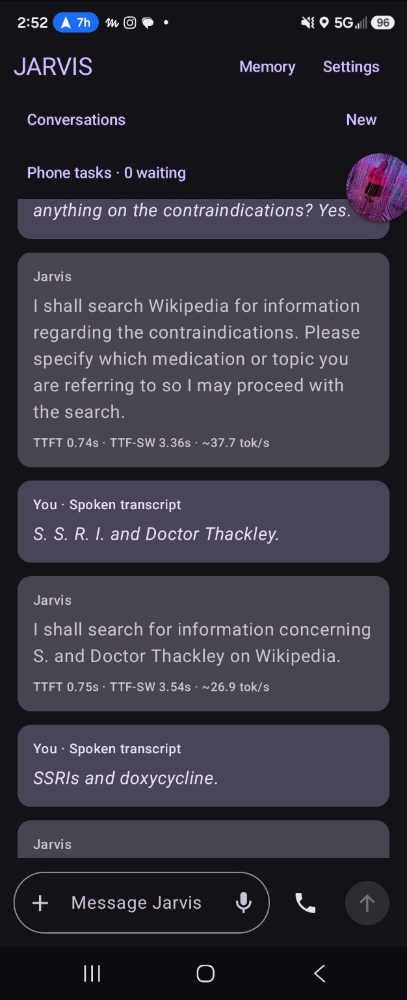

# Fold 6 screenshot baseline — October 2, 2026

Seven unique assistant replies supplied by Justin Battles during physical-phone testing. These are observations transcribed from the app footer, not a controlled corpus or a claim of response accuracy. Duplicate views of the same reply are counted once. Original screenshots are retained unchanged with SHA-256 hashes in [manifest.json](manifest.json); machine-readable values are in [observations.csv](observations.csv).

| Sample | Displayed TTFT (s) | Displayed TTF-SW (s) | Estimated tok/s | Screenshot |
|---|---:|---:|---:|---|
| travel | 2.00 | 3.78 | 42.7 | [source](1000032798.jpg) |
| travel-followup | 0.68 | 3.60 | 36.3 | [source](1790966921382.jpeg) |
| audio-access-reply | 0.68 | 3.05 | 38.6 | [source](1790966921382.jpeg) |
| medication | 0.96 | 4.59 | 28.1 | [source](1790967071057.jpeg) |
| cubs | 0.38 | 8.76 | 19.3 | [source](1000032785.jpg) |
| wikipedia | 0.74 | 3.36 | 37.7 | [source](1000032796.jpg) |
| followup | 0.75 | 3.54 | 26.9 | [source](1000032796.jpg) |

| Statistic | TTFT (s) | TTF-SW (s) | Estimated tok/s |
|---|---:|---:|---:|
| Mean | 0.88 | 4.38 | 32.8 |
| Median | 0.74 | 3.60 | 36.3 |
| Range | 0.38–2.00 | 3.05–8.76 | 19.3–42.7 |

## Definitions and limitations

Current ReplyMetrics code defines TTFT as model submission to first raw text callback, and TTF-SW as last detected speech to first reply playback. Playback is a playback-head proxy, not measured acoustic onset. The installed build is not visible, so these definitions cannot yet be bound to the screenshot build. Footer throughput uses a character-based token estimate, not native token counting. Output token totals and barge-in timings are not visible in these screenshots; no values are inferred for them.

Phone identification comes from the user's Fold 6 test context. Exact APK/build/source commit, selected Gemma model, Moonshine/Whisper/direct-audio input route, runtime/backend, settings, battery/thermal conditions and utterance ground truth are not established. Do not use this baseline to rank those routes or claim an improvement over a different setup. Screenshots include observed incorrect replies and are not evidence of accuracy.

## Continue the series

After a conversation, use **Copy metrics**, or **Metrics → Save JSON/CSV** for larger reports. Keep the original exported report with a dated entry. Future reports contain build/source/device/model/configuration provenance, raw attempts and metric statuses. Compare like configurations and record failed/cancelled attempts. Use sufficient samples for percentile claims. Exported metrics omit prompts, transcript text and microphone audio.

These observations show the current measured range; they establish no speed improvement by themselves. Earlier chat-recalled Whisper/Moonshine timings are not included without original attributable evidence.

## Screenshots

