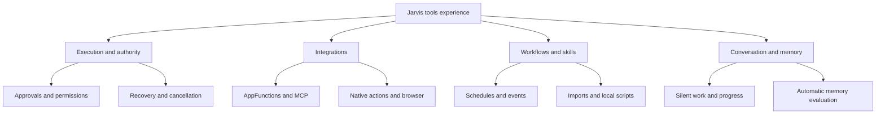

# Tools, AppFunctions, MCP, workflows and skills: implementation plan

Planning baseline: `feature-tools` at `54f133f03d9d0c6fd44e424d96a8453bf7d4d24c`.
Date: September 24, 2026. Owner: Justin Battles.
Status: implementation-ready decomposition of the completed interview; no runtime feature work performed by this document.

The [decision record](tools-interview-decisions.md) is authoritative for product choices. Background: [original audit](../research/feature-tools-audit-2026-09-24.md) and [AppFunctions landscape](../research/appfunctions-landscape-2026-09-24.md). Their API/access findings are dated research snapshots: revalidate when integrating, rather than assuming permanent availability.

## Product outcome and design tree

Jarvis carries out local-model-directed tasks while remaining conversationally available. It owns background tasks independently of the voice call, discovers usable tools, requests exact action approvals, reports honest outcomes, and turns successful behavior into reusable workflows. Online services supply data/actions; reasoning and custom scripts remain local.

All branches converge on one validated execution runtime. Separate adapters do not create separate permission systems or competing task queues.

## 1. Architecture and invariants

### Shared capability contracts

Introduce a capability registry with source/provider identity, stable tool identity, versioned input/output schema, availability, required scopes, resource locks, side-effect classification, completion meaning and cancellation/retry policy. Generate model declarations and strict validators from the same contract. Imported metadata is descriptive context, never authority. Bind model-visible aliases to full provider/package/function identities without collisions.

Direct Android actions remain efficient native calls. AppFunctions maps discovery/state/typed data into this registry; MCP maps negotiated server tools. Browser and accessibility executors use the same authority checks. Reject unsupported types explicitly. Recheck scope, enabled state, provider/schema version, and approval immediately before dispatch.

Preserve exact fast paths and existing 1–3-step plans. Add an explicit workflow classification; do not route every rejected request into a more permissive agent loop. Fixed plans, typed conditional graphs and bounded adaptive loops are separate plan forms over one executor. Simple conditions run in code. The model proposes actions; it does not authorize its own proposals.

### Task ownership and recovery

Create a durable local ledger for task group, task, step, attempt, result binding, approval, grant provenance, and progress event. Suggested step states: queued, ready, running, waiting-input, waiting-resource, paused, succeeded, failed, cancelled, unknown-outcome. Record dispatch intent before effects and receipts afterward. Exactly-once external effects cannot be assumed: reconcile unknown outcomes before retrying or changing adapters.

Each attempt has an ID and generation fence. Ignore stale completions. Independent steps may run concurrently; conflicting app/screen steps serialize. Model inference uses the existing exclusive model lease and scheduling priority, rather than loading multiple large engines for every task. Memory review yields to interaction. Use bounded per-task time/attempt budgets plus progress tracking, with user escalation at the limit.

Normal failures stop affected dependents; independent branches continue. Cancellation prevents future effects and cooperatively stops active work where supported. A completed or already-committed Android operation is not undone. Reboot recovery verifies platform/account/session state before resumption. Ending speech or a voice call cannot cancel task ownership.

### Authority and exact approvals

Persist source access grants, routine-scoped reusable grants, revocations and expiry. Reuse an enabled routine's permission only when exact action/target limits and conditions match; record which grant justified each dispatch. Ambiguous harm or scope is a reason to ask. Denial must not trigger a bypass through another adapter.

The D11 action classes always require individual approval. Bind each request to task/step, provider, normalized arguments, schema version and action revision. Approve buttons are unconsumed choices, not preauthorization. A changed recipient/body/target invalidates the prior request. A spoken yes maps only to the active explicit question; competing or stale questions require clarification. Approval consumption and dispatch eligibility must be atomic locally. Recheck after revocation or schema changes.

Disabling a routine stops future dispatches relying on that grant and pauses affected unfinished work, asking whether to continue under a new grant. Do not pause unrelated tasks. Expired screen-session grants cannot be reused by later task groups.

### Conversation, silent work, and control

Keep voice lifecycle, task lifecycle and screen lease independent. Proposed voice states: conversational, silently-working, awaiting-answer, ended. Task start enters silent work; wake phrase reopens conversation without restarting the task. While an active call needs input, ask aloud, accept the answer, then return to silent work. Ended calls receive chat/notification requests, not continued microphone capture merely because work remains.

Store one addressable progress message per task, update current step/status, and retain the final summary. Questions can arrive without a new user turn. Outside calls, notify and leave chat messages, respecting system Do Not Disturb. Show an overlay Stop control during screen work with the current task identity. Stop targets that task; stop-all targets all tasks. Speech-only stop preserves work.

User touch/navigation pauses screen dispatch. After a configurable idle interval, re-observe and validate the current app/screen before resuming without countdown. Observation retries may repeat; mutation retries may not blindly repeat. Define a task group at admission and explicitly associate overlapping tasks needing its screen lease. Group completion/revocation releases the lease and removes the overlay. Locked screens suspend operations requiring unlock while independent work continues.

Speaker verification is required before locked-device actions or private readout. Test enrollment, unknown speakers, recordings, acoustic conditions and confidence failure. It supplements but cannot replace Android-required authentication. Until verified, gate this mode and use unlock handoff; do not describe an untested voice match as secure authorization.

### Browser and local scripts

Build an internal browser behind typed tools; use native handoff where needed without assuming cookie/session sharing. Pause automation during user login/2FA/CAPTCHA takeover and resume only with a validated page/session. Integrate password-manager handoff without putting credentials in model prompts, task logs or memory. Requested forms may submit, but D11 actions need approval bound to the final destination/content.

Select a local script runtime through a bounded prototype. Require an isolated process/runtime boundary, no ambient Android permissions, an allowlisted host-tool bridge, resource/time/output limits, interruptibility and scoped file/network access. All consequential script actions pass through the same approval executor. No remote compute fallback. Unsupported scripts remain disabled with an explanation. Do not claim arbitrary Python/Node/browser scripts are supported until tested.

### Memory bridge and privacy

Global automatic memory defaults on. Capture minimal candidates from authorized chat/voice/tool sources; separate self-review and idle-model relevance evaluation from task execution. Persist relevance, confidence, source reference, temporal validity and evaluator version, then commit qualifying memories through the existing Memory OS store/index. The user does not routinely approve candidates. Memory facts never create execution grants.

Use stronger evidence for automatic updates with lineage/history. Manual edits/deletions fence old candidates, queued evaluations and old sources; they cannot resurrect content after restart. Exclude credentials before candidate persistence. Keep short-lived raw tool data only as needed for active task/evaluation, then discard unless explicitly saved. Surviving history should contain summaries/steps/errors, minimal receipts and source references, not full retrieved content or secrets. Deletion also governs cached/indexed/history material; retain only minimal non-content suppression metadata when needed to prevent re-ingestion.

Integrate with the existing memory wiki and its current branch work. This intentionally changes the old manual-review default, so test the migration explicitly rather than silently relabeling old approval tests. When automatic mode is off, proposed default is existing manual/explicit-save behavior; document that as an engineering default.

## 2. Delivery milestones

Each user-facing milestone produces a usable release candidate after exact-revision automation, followed by Fold 6 acceptance. M0 is preparation, not a substitute for the first release. Substeps below permit small commits but do not reduce M1's agreed scope.

| Milestone | Deliverable | Dependencies | Decisions |
|---|---|---|---|
| M0 | Integration baseline, contract design, CI branch support, feasibility probes | Current agreed branch heads | D05,D08,D30,D42,D50–D52 |
| M1 | Reliable phone commands and approved screen control while tasks and conversation coexist | M0 | D01,D04,D09–D30,D35–D38,D50–D51 |
| M2 | Durable saved workflows, typed branches, schedules/events and proactive actions | M1 ledger/authority | D12–D18,D27–D29,D31–D36,D41 |
| M3 | AppFunctions discovery and real supported app operations; guided/custom MCP | M1 contracts; access gates independent | D02–D10,D03,D37 |
| M4 | Internal browser, native/auth handoff, research answers and approved form submission | M1 approvals/screen; M3 where useful | D02,D11–D15,D37–D40 |
| M5 | Community imports/exports, compatible updates, isolated on-phone scripts | M2 definitions; M3 tools; M0 isolation probe | D31,D41–D44 |
| M6 | Global automatic memory evaluation and wiki integration | M1 events/lease; existing Memory OS integration | D38,D45–D49 |
| M7 | Optional external-agent access to narrowly scoped Jarvis AppFunctions | M2,M3; provider authorization tests | D06,D11–D17 |
| M8 | FunctionGemma comparison and adoption decision | Stable M1–M5 tool workloads | D08,D52 |

M3 discovery/access work starts in M0, not after all workflows. M6 can develop against agreed interfaces alongside other milestones, but shared files have one integration owner. This plan does not itself spawn workers, merge branches or start runtime development.

### M0: prepare and resolve platform assumptions

- Refresh `audio-pr2` and Memory OS heads and document the agreed implementation baseline. Preserve ongoing work; reconcile only under applicable authorization. This planning commit leaves them unchanged.
- Fix both trigger and job-condition coverage for `feature-tools` before runtime changes depend on CI; ensure release and compact artifacts are available through a GitHub page.
- Recheck the audited `open_app.package` schema mismatch and unused model-pass limit against that baseline, then fix remaining instances through the shared contract.
- Probe ordinary-app AppFunctions support, caller eligibility, visibility and available functions separately from ADB testing. Revalidate current Jetpack/compiler versions and compile/target/min SDK decisions.
- Prototype release-compatible overlay stop, user-touch observation, background work, media access, speaker verification and local script isolation. Record blockers and supported alternatives. No privilege bypasses or tests that silently enable restricted production modes.
- Produce an app capability matrix for the named target apps: operation, available adapter, auth/permission, tested device/version, known limitation, evidence. Do not equate sample-provider success with Gmail/WhatsApp support.

### M1: first usable release, all requested phone commands

M1a establishes typed results, grants/approvals, minimal durable attempts and shared text/voice execution. M1b adds app launch/battery/volume, website/settings/map destinations and media play/pause/skip. M1c adds compact screen observation, tap/scroll/type with verified targets, temporary touch takeover, session grant and floating Stop. M1d integrates silent work, wake reactivation, concurrent independent tasks, task-targeted cancellation, call-end continuity and chat/notification progress. M1e completes permission/lock handling and regression/device validation.

Definition of done: execute each command family through its supported Android adapter, preserve actual results, accept another instruction during a task, cancel only the intended task, and continue after call end. Prove overlay stop and touch pause/resume in real apps on Fold 6. No acknowledged-only tool response counts as completion. Do not label M1 complete if requested screen/media families are deferred; report a partial candidate and its remaining gates explicitly.

### M2: reusable workflows and triggers

Implement versioned step graphs with typed result bindings, deterministic conditions, event/timer waits and bounded adaptive steps. Create via conversation or successful-task capture, with a plain-language preview and explicit enabling. Add task-specific effort budgets, safe alternatives and unknown-outcome recovery. Persist event occurrence/deduplication so restarts do not replay triggers.

Reminders target requested time; flexible routines use scheduling windows. Account for timezone/DST changes and Android scheduling permissions. Missed runs are evaluated against current circumstances by the local planner; ask if uncertain, report missed otherwise, and keep occurrence/decision receipts. No catch-up duplicate storm. Implement reusable routine grants with revocation and independent approval branches. Settings lists saved workflows/connected tools; chat remains the operating surface.

### M3: ecosystem integrations

Implement metadata/state discovery and invalidation, task-relevant tool selection, collision-safe names, strict nested type conversion and typed errors/URI/user-interaction results. Validate one controlled dependent function journey, then actual supported priority apps. MCP needs guided setup plus custom URLs, secure stored auth, session/version negotiation, discovery refresh and explicit unavailable/denied states. New functions stay within existing grants; free-only is default until service enablement. Paid enablement never waives purchase confirmation. Do not claim an unknown-price operation is free.

Definition of done: the capability matrix has real evidence for each advertised operation, successful calls and negative cases, and UI explains unavailable providers. Broad AppFunctions access may remain blocked without blocking other validated adapters. Keep provider exposure disabled until M7.

### M4: browser tasks

Ship internal browsing, page/source inspection, navigations, filling and submission; add native handoff and password-manager handoff. Use concise cited answers and preserve source provenance across results. Check host/destination and final form content at dispatch. Manual takeover pauses automation; detect changed pages on return. Test with controlled signed-in sites/forms and a credential handoff fixture, then supported real phone flows without sending real payments/messages during automation tests.

### M5: community workflows and scripts

Use versioned manifests with required tool contracts, permitted scopes, script runtime requirements and provenance. Imports require review; unavailable dependencies save disabled. Export removes accounts, tokens, personal argument values, private endpoints, identifiers and embedded content, replacing them with required setup bindings. Provide an export preview.

Updates auto-apply only when unchanged permission and behavioral equivalence can be established under a narrow deterministic rule (for example, documentation-only changes). A model's assertion is insufficient to certify arbitrary code equivalence; changed scripts default to review. Pin running workflows to their admitted version. Sandbox tests must prove denial of unauthorized file/network/tool access, resource exhaustion termination and cancellation; an ordinary WebView with a broad native bridge is not sufficient evidence.

### M6: automatic memory

Deliver global default-on setting, candidate self-review, separate interruptible local evaluation, versioned scores and automatic wiki/index updates. Preserve edit/delete lineage and anti-resurrection fences. Include positive/negative/conflicting/credential fixtures, source-permission revocation, queued-evaluation races and prompt retrieval after index changes. Tune relevance and confidence with a held-out fixture set; thresholds are measured engineering defaults, not user-selected constants. Normal memory learning requires no user review; routine/skill activation still does.

### M7 and M8: later additions

M7 exposes narrow existing use cases through a protected provider boundary after caller authorization and anti-recursion checks; external agents do not inherit the user's session grants. M8 compares the exact-command path, selected E2B/E4B and optional FunctionGemma on matched tasks, same schemas and Fold 6 conditions. Report cold/warm p50/p95 full-action latency, correct arguments/order, unintended actions, memory/thermal behavior and artifact/backend identity. Do not enable on tokens/second alone. Require reliability non-regression and meaningful latency improvement; otherwise retain the existing path.

## 3. Acceptance matrix

J = JVM/contract; A = Android integration/release UI; D = real weights/physical Fold 6. Every entry is planned, not passing evidence.

| Test | Observable acceptance | Level | Milestone |
|---|---|---|---|
| T01 | Each M1 command family produces the actual requested effect and a truthful receipt; invalid args produce no effects | J,A,D | M1 |
| T02 | Follow-up while work runs executes independently or queues on app/screen conflicts; normal chat causes no tool calls | J,A,D | M1 |
| T03 | Speech-only stop preserves work; task stop cancels target; stop-all cancels remaining work; no replay of completed effects | J,A,D | M1 |
| T04 | Call ends while screen task continues; progress persists in chat; finished group releases control | J,A,D | M1 |
| T05 | Task start enters silence; ordinary speech ignored; wake reopens conversation; needed question temporarily listens for answer | J,A,D | M1 |
| T06 | Overlay follows screen work; manual touch pauses dispatch; idle resume re-observes changed screen without countdown | J,A,D | M1 |
| T07 | D11 categories each require exact individual approval; revised action invalidates old button; ambiguous yes cannot authorize | J,A,D | M1,M2 |
| T08 | First-source access remembered; new tool cannot broaden scope; denial/revocation blocks all adapters | J,A | M1,M3 |
| T09 | Owner recognition gates locked private readout/actions; unknown/replayed/uncertain voice cannot silently authorize | J,A,D | M1 device gate |
| T10 | Crash before/after dispatch reconciles outcomes; unknown mutation never blindly repeats; stale callback rejected | J,A | M1,M2 |
| T11 | Approval waits block dependents only; routine grant reuse matches limits; disable pauses affected tasks | J,A | M2 |
| T12 | Conversation-created/captured workflow shows summary and requires enablement; revisions do not mutate running version | J,A,D | M2 |
| T13 | Reminder timing and DND; flexible schedules, notification/location triggers, DST and reboot deduplication | J,A,D | M2 |
| T14 | Missed task relevant/irrelevant/uncertain outcomes; bounded effort/no-progress asks user without duplicate effects | J,A,D | M2 |
| T15 | Proactive chat question and notification without user turn; in-call completions silent; source references survive | J,A,D | M1–M4 |
| T16 | AppFunctions nested schema/types, state/update/uninstall/name collisions; ordinary-app access vs ADB labeled | J,A,D | M3 |
| T17 | MCP guided/custom connection, auth failure, disconnect, schema change, scope limits and paid-service default | J,A | M3 |
| T18 | Browser manual/auth/native handoff, changed-page validation, sensitive submit approval; credentials absent from logs/memory | J,A,D | M4 |
| T19 | Import review, disabled missing dependencies, sanitized export, compatible auto-update vs changed-script review | J,A | M5 |
| T20 | Isolated scripts cannot escape grants; CPU/memory/output limits and stop work; unsupported runtimes explain failure | J,A,D | M5 |
| T21 | Default-on local memory pipeline saves relevant evidence, excludes credentials, yields to user, updates wiki and retrieval | J,A,D | M6 |
| T22 | Stronger evidence keeps history; manual correction/deletion defeats old sources and queued evaluations after restart | J,A | M6 |
| T23 | Raw retrieved content expires after use unless saved; task summaries/receipts persist without sensitive payload leakage | J,A | M1–M6 |
| T24 | External caller cannot obtain ungranted scope or evade approval; recursive agent calls bounded | J,A | M7 |
| T25 | Matched real-device benchmark supports enable/retain decision; no fabricated latency or reliability result | D | M8 |

Follow `.agents/skills/jarvis-verify/SKILL.md`: add named release journeys and `scripts/verification/scenarios.json` together. Preserve existing gates and failed evidence. Each release needs exact SHA/run, signed normal/compact APK hashes, JVM/native/helper results, Android journey outcomes and explicit physical-model gaps. Provide a GitHub page where Justin can choose release or compact APK. No debug APK substitution, automatic PR creation, main merge or invented signoff.

## 4. Work ownership and integration

| Work package | Existing/proposed file ownership | Coordination boundary |
|---|---|---|
| Core runtime | Existing `actions/`; proposed `tools/`, `workflows/` under the app package | Own schemas/ledger/grants; publish interfaces first |
| Voice/conversation integration | Existing `conversation/`, `voice/` and conversation UI | One integration owner; preserve current Audio PR2 fixes |
| Platform adapters | Proposed tool adapter packages, Android manifest/service declarations | Manifest and Gradle edits serialized with integration owner |
| Browser | Proposed browser package and browser UI | Use core executor; no second authority path |
| Skills/scripts | Proposed skills package and isolated runtime bridge | Depend on stable host-tool contract; runtime/license review before adoption |
| Memory | Existing memory store/retrieval/wiki and evaluator bridge | Coordinate with current Memory OS branch; no competing wiki or blind overwrite |
| Acceptance/CI | `docs/verification/features.md`, scenarios, ReleaseJourneyTest, workflows | One owner adds named gates; do not weaken tests to merge work |

Package names above are proposed logical boundaries, not a requirement to split Gradle modules before evidence justifies it. Before each work package, refresh the agreed baseline and resolve overlaps explicitly. Work stays on feature-tools or explicitly agreed isolated branches; no force pushes over other sessions. Integration into audio-pr2 or main requires the applicable user authorization and combined-revision checks.

## 5. Epic and completion tracking

Create one tracking epic from M0–M8 with checkboxes and links to this plan and the decision record. Track engineering gates separately from user decisions. At work start, split the active milestone into bounded issues using the work packages, acceptance IDs, file ownership and evidence requirements above; do not pre-create dozens of speculative tickets. A milestone checkbox closes only when its defined scope and evidence are complete, or Justin explicitly changes scope.

The first coding step is M0 followed by M1a. This planning pass creates documents and an epic only; it does not implement or certify any milestone.
