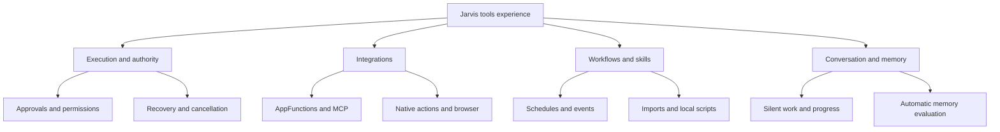

# Tools, AppFunctions, MCP, workflows and skills: implementation plan

Original planning baseline: `feature-tools` at `54f133f03d9d0c6fd44e424d96a8453bf7d4d24c`.
Follow-up source baseline: `feature-tools` at `bfeca6d06dc3dba583e0f92e812046e9e73379f2`.
Created: September 24, 2026. Updated: September 29, 2026 (America/New_York). Owner: Justin Battles.
Status: existing tools scope retained; September 29 autonomous messaging/warm-inference requirements integrated. New phases below are planned, not implemented or verified by this documentation update.

The [decision record](tools-interview-decisions.md) is authoritative for product choices. Background: [original audit](../research/feature-tools-audit-2026-09-24.md) and [AppFunctions landscape](../research/appfunctions-landscape-2026-09-24.md). Their API/access findings are dated research snapshots: revalidate when integrating, rather than assuming permanent availability.

## Product outcome and design tree

Jarvis carries out local-model-directed tasks while remaining conversationally available. It owns background tasks independently of the voice call, discovers usable tools, requests exact action approvals, reports honest outcomes, and turns successful behavior into reusable workflows. Online services supply data/actions; reasoning and custom scripts remain local.

```mermaid
flowchart TD
    J[Jarvis tools experience] --> E[Execution and authority]
    J --> I[Integrations]
    J --> W[Workflows and skills]
    J --> U[Conversation and memory]
    E --> P[Approvals and permissions]
    E --> R[Recovery and cancellation]
    I --> A[AppFunctions and MCP]
    I --> B[Native actions and browser]
    W --> S[Schedules and events]
    W --> C[Imports and local scripts]
    U --> V[Silent work and progress]
    U --> M[Automatic memory evaluation]
```

All branches converge on one validated execution runtime. Separate adapters do not create separate permission systems or competing task queues.

## 1. Architecture and invariants

### Shared capability contracts

Introduce a capability registry with source/provider identity, stable tool identity, versioned input/output schema, availability, required scopes, resource locks, side-effect classification, completion meaning and cancellation/retry policy. Generate model declarations and strict validators from the same contract. Imported metadata is descriptive context, never authority. Bind model-visible aliases to full provider/package/function identities without collisions.

Direct Android actions remain efficient native calls. AppFunctions maps discovery/state/typed data into this registry; MCP maps negotiated server tools. Browser and accessibility executors use the same authority checks. Reject unsupported types explicitly. Recheck scope, enabled state, provider/schema version, and approval immediately before dispatch.

Preserve exact fast paths and existing 1–3-step plans. Add an explicit workflow classification; do not route every rejected request into a more permissive agent loop. Fixed plans, typed conditional graphs and bounded adaptive loops are separate plan forms over one executor. Simple conditions run in code. The model proposes actions; it does not authorize its own proposals.

### Task ownership and recovery

Create a durable local ledger for task group, task, step, attempt, result binding, approval, grant provenance, and progress event. Suggested step states: queued, ready, running, waiting-input, waiting-resource, paused, succeeded, failed, cancelled, unknown-outcome. Record dispatch intent before effects and receipts afterward. Exactly-once external effects cannot be assumed: reconcile unknown outcomes before retrying or changing adapters.

Each attempt has an ID and generation fence. Ignore stale completions. Independent steps may run concurrently; conflicting app/screen steps serialize. Model inference uses the existing exclusive model lease and scheduling priority, rather than loading multiple large engines for every task. Event-driven memory evaluation and proactive inference yield to interaction; no periodic memory-review loop is introduced. Use bounded per-task time/attempt budgets plus progress tracking, with user escalation at the limit.

Normal failures stop affected dependents; independent branches continue. Cancellation prevents future effects and cooperatively stops active work where supported. A completed or already-committed Android operation is not undone. Reboot recovery verifies platform/account/session state before resumption. Ending speech or a voice call cannot cancel task ownership.

### Authority and exact approvals

Persist source access grants, routine-scoped reusable grants, revocations and expiry. Reuse an enabled routine's permission only when exact action/target limits and conditions match; record which grant justified each dispatch. Ambiguous harm or scope is a reason to ask. Denial must not trigger a bypass through another adapter.

The D11 action classes always require individual approval. Bind each request to task/step, provider, normalized arguments, schema version and action revision. Approve buttons are unconsumed choices, not preauthorization. A changed recipient/body/target invalidates the prior request. A spoken yes maps only to the active explicit question; competing or stale questions require clarification. Approval consumption and dispatch eligibility must be atomic locally. Recheck after revocation or schema changes.

Disabling a routine stops future dispatches relying on that grant and pauses affected unfinished work, asking whether to continue under a new grant. Do not pause unrelated tasks. Expired screen-session grants cannot be reused by later task groups.

### Conversation, silent work, and control

Keep voice lifecycle, task lifecycle and screen lease independent. Proposed voice states: conversational, explicitly silently-working, awaiting-answer, ended. Starting a task in a conversational call retains listening and continuous readout; the September 29 decision supersedes automatic task-start silence. In explicit silent work, the wake phrase reopens conversation without restarting tasks, and a required question may temporarily request an answer before returning to silence. Ended calls receive chat/notification requests, not continued microphone capture merely because work remains.

Keep one addressable task-status projection plus an ordered sequence of chat bubbles grouped under the logical task/turn. Bubble completion is distinct from turn completion. Stream complete thoughts without a new model pass per bubble; progress comes from actual task events and the final explanation retains necessary detail. Questions can arrive without a new user turn. Read successive messages during conversational calls; outside calls, notify and leave chat messages without speech. During Do Not Disturb, post a silent notification immediately. Cache pending delivery through interruptions and revalidate against the latest user instruction before resuming. Show an overlay Stop control during screen work with the current task identity. Stop targets that task; stop-all targets all tasks. Speech-only stop preserves work.

User touch/navigation pauses screen dispatch. After a configurable idle interval, re-observe and validate the current app/screen before resuming without countdown. Observation retries may repeat; mutation retries may not blindly repeat. Define a task group at admission and explicitly associate overlapping tasks needing its screen lease. Group completion/revocation releases the lease and removes the overlay. Locked screens suspend operations requiring unlock while independent work continues.

Speaker verification is required before permitted locked-device actions or non-sensitive private readout. Sensitive remembered details always require unlocking, even if the speaker is recognized. Test enrollment, unknown speakers, recordings, acoustic conditions and confidence failure. It supplements but cannot replace Android-required authentication. Until verified, gate this mode and use unlock handoff; do not describe an untested voice match as secure authorization.

### Browser and local scripts

Build an internal browser behind typed tools; use native handoff where needed without assuming cookie/session sharing. Pause automation during user login/2FA/CAPTCHA takeover and resume only with a validated page/session. Integrate password-manager handoff without putting credentials in model prompts, task logs or memory. Requested forms may submit, but D11 actions need approval bound to the final destination/content.

Select a local script runtime through a bounded prototype. Require an isolated process/runtime boundary, no ambient Android permissions, an allowlisted host-tool bridge, resource/time/output limits, interruptibility and scoped file/network access. All consequential script actions pass through the same approval executor. No remote compute fallback. Unsupported scripts remain disabled with an explanation. Do not claim arbitrary Python/Node/browser scripts are supported until tested.

### Memory bridge and privacy

Global automatic memory defaults on. Capture minimal candidates from authorized chat/voice/tool sources; separate self-review and idle-model relevance evaluation from task execution. Persist relevance, confidence, source reference, temporal validity and evaluator version, then commit qualifying memories through the existing Memory OS store/index. The user does not routinely approve candidates. Memory facts never create execution grants.

Use stronger evidence for automatic updates with lineage/history. Manual edits/deletions fence old candidates, queued evaluations and old sources; they cannot resurrect content after restart. Exclude credentials before candidate persistence. Keep short-lived raw tool data only as needed for active task/evaluation, then discard unless explicitly saved. Surviving history should contain summaries/steps/errors, minimal receipts and source references, not full retrieved content or secrets. The confirmed Memory OS policy allows retained message-source text to remain searchable for 90 days after deleting a saved fact, but only an explicit request about that history may retrieve the deleted information. Purge the fact from ordinary recall, indexes/caches and unsolicited delivery; retain minimal suppression metadata so retained evidence cannot resurrect it. Raw tool payloads still follow D38's discard-unless-saved policy.

Integrate with the existing memory wiki and its current branch work. Preserve the separate confirmed Memory OS choices: new-message-only ingestion from supported SMS/MMS, email and Messenger adapters; on-device storage; source badges; no credential memory; sensitive details require unlock. Source availability and ingestion are adapter dependencies, not evidence that this branch already collects those apps. This intentionally changes the old manual-review default, so test the migration explicitly rather than silently relabeling old approval tests. When automatic mode is off, proposed default is existing manual/explicit-save behavior; document that as an engineering default.

## 2. Delivery milestones

Each user-facing milestone produces a usable release candidate after exact-revision automation, followed by Fold 6 acceptance. M0 is preparation, not a substitute for the first release. Substeps below permit small commits but do not reduce M1's agreed scope.

| Milestone | Deliverable | Dependencies | Decisions |
|---|---|---|---|
| M0 | Integration baseline, contract design, CI branch support, feasibility probes | Current agreed branch heads | D05,D08,D30,D42,D50–D52 |
| M1 | Reliable phone commands and approved screen control while tasks and conversation coexist | M0 | D01,D04,D09–D30,D35–D38,D50–D51 |
| M2 | Durable saved workflows, typed branches, schedules/events and proactive actions | M1 ledger/authority | D12–D18,D27–D29,D31–D36,D41 |
| M3 | AppFunctions discovery and real supported app operations; guided/custom MCP | M1 contracts; access gates independent | D02–D10,D03,D37 |
| M4 | Internal browser, native/auth handoff, research answers and approved form submission | M1 approvals/screen; M3 where useful | D02,D11–D15,D37–D40 |
| M5 | Community imports/exports, compatible updates, isolated on-phone scripts | M2 definitions; M3 tools; M0 isolation probe | D31,D41–D44 |
| M6 | Global automatic memory evaluation and wiki integration | M1 events/lease; existing Memory OS integration | D38,D45–D49 |
| M7 | Optional external-agent access to narrowly scoped Jarvis AppFunctions | M2,M3; provider authorization tests | D06,D11–D17 |
| M8 | FunctionGemma comparison and adoption decision | Stable M1–M5 tool workloads | D08,D52 |

M3 discovery/access work starts in M0, not after all workflows. M6 can develop against agreed interfaces alongside other milestones, but shared files have one integration owner. This plan does not itself spawn workers, merge branches or start runtime development.

### M0: prepare and resolve platform assumptions

- Refresh `audio-pr2` and Memory OS heads and document the agreed implementation baseline. Preserve ongoing work; reconcile only under applicable authorization. This planning commit leaves them unchanged.
- Preserve and verify the existing `feature-tools` push trigger and build-job condition; they are present in the inspected baseline. Ensure the selected implementation revision receives the required release/compact checks and artifacts through a GitHub page.
- Recheck the audited `open_app.package` schema mismatch and unused model-pass limit against that baseline, then fix remaining instances through the shared contract.
- Probe ordinary-app AppFunctions support, caller eligibility, visibility and available functions separately from ADB testing. Revalidate current Jetpack/compiler versions and compile/target/min SDK decisions.
- Prototype release-compatible overlay stop, user-touch observation, background work, media access, speaker verification and local script isolation. Record blockers and supported alternatives. No privilege bypasses or tests that silently enable restricted production modes.
- Produce an app capability matrix for the named target apps: operation, available adapter, auth/permission, tested device/version, known limitation, evidence. Do not equate sample-provider success with Gmail/WhatsApp support.

### M1: first usable release, all requested phone commands

M1a establishes typed results, grants/approvals, minimal durable attempts and shared text/voice execution. M1b adds app launch/battery/volume, website/settings/map destinations and media play/pause/skip. M1c adds compact screen observation, tap/scroll/type with verified targets, temporary touch takeover, session grant and floating Stop. M1d integrates explicit silent work, wake reactivation, concurrent independent tasks, task-targeted cancellation, call-end continuity and chat/notification progress. Conversational calls retain continuous multi-bubble readout and barge-in. M1e completes permission/lock handling and regression/device validation. The September 29 extension adds the A0–A6 phases below across M0/M1/M2/M6; it does not narrow M1's phone/media/screen acceptance.

Definition of done: execute each command family through its supported Android adapter, preserve actual results, accept another instruction during a task, cancel only the intended task, and continue after call end. Prove overlay stop and touch pause/resume in real apps on Fold 6. No acknowledged-only tool response counts as completion. Do not label M1 complete if requested screen/media families are deferred; report a partial candidate and its remaining gates explicitly.

### M2: reusable workflows and triggers

Implement versioned step graphs with typed result bindings, deterministic conditions, event/timer waits and bounded adaptive steps. Create via conversation or successful-task capture, with a plain-language preview and explicit enabling. Add task-specific effort budgets, safe alternatives and unknown-outcome recovery. Persist event occurrence/deduplication so restarts do not replay triggers.

Reminders target requested time; flexible routines use scheduling windows. Relevant known deadlines also create internal reminder occurrences automatically under D62, without requiring a separately enabled general workflow. New information and persisted deadline timers drive proactive evaluation; do not periodically scan memories. Account for timezone/DST changes and Android scheduling permissions. Missed runs are evaluated against current circumstances by the local planner; ask if uncertain, report missed otherwise, and keep occurrence/decision receipts. No catch-up duplicate storm. Implement reusable routine grants with revocation and independent approval branches. Settings lists saved workflows/connected tools; chat remains the operating surface.

### M3: ecosystem integrations

Implement metadata/state discovery and invalidation, task-relevant tool selection, collision-safe names, strict nested type conversion and typed errors/URI/user-interaction results. Validate one controlled dependent function journey, then actual supported priority apps. MCP needs guided setup plus custom URLs, secure stored auth, session/version negotiation, discovery refresh and explicit unavailable/denied states. New functions stay within existing grants; free-only is default until service enablement. Paid enablement never waives purchase confirmation. Do not claim an unknown-price operation is free.

Definition of done: the capability matrix has real evidence for each advertised operation, successful calls and negative cases, and UI explains unavailable providers. Broad AppFunctions access may remain blocked without blocking other validated adapters. Keep provider exposure disabled until M7.

### M4: browser tasks

Ship internal browsing, page/source inspection, navigations, filling and submission; add native handoff and password-manager handoff. Use concise cited answers and preserve source provenance across results. Check host/destination and final form content at dispatch. Manual takeover pauses automation; detect changed pages on return. Test with controlled signed-in sites/forms and a credential handoff fixture, then supported real phone flows without sending real payments/messages during automation tests.

### M5: community workflows and scripts

Use versioned manifests with required tool contracts, permitted scopes, script runtime requirements and provenance. Imports require review; unavailable dependencies save disabled. Export removes accounts, tokens, personal argument values, private endpoints, identifiers and embedded content, replacing them with required setup bindings. Provide an export preview.

Updates auto-apply only when unchanged permission and behavioral equivalence can be established under a narrow deterministic rule (for example, documentation-only changes). A model's assertion is insufficient to certify arbitrary code equivalence; changed scripts default to review. Pin running workflows to their admitted version. Sandbox tests must prove denial of unauthorized file/network/tool access, resource exhaustion termination and cancellation; an ordinary WebView with a broad native bridge is not sufficient evidence.

### M6: automatic memory

Deliver global default-on setting, candidate self-review, separate interruptible local evaluation, versioned scores and automatic wiki/index updates. Preserve edit/delete lineage and anti-resurrection fences. Include positive/negative/conflicting/credential fixtures, source-permission revocation, queued-evaluation races and prompt retrieval after index changes. Tune relevance and confidence with a held-out fixture set; thresholds are measured engineering defaults, not user-selected constants. Normal memory learning requires no user review; routine/skill activation still does.

### M7 and M8: later additions

M7 exposes narrow existing use cases through a protected provider boundary after caller authorization and anti-recursion checks; external agents do not inherit the user's session grants. M8 compares the exact-command path, selected E2B/E4B and optional FunctionGemma on matched tasks, same schemas and Fold 6 conditions. Report cold/warm p50/p95 full-action latency, correct arguments/order, unintended actions, memory/thermal behavior and artifact/backend identity. Do not enable on tokens/second alone. Require reliability non-regression and meaningful latency improvement; otherwise retain the existing path.

## 3. Acceptance matrix

J = JVM/contract; A = Android integration/release UI; D = real weights/physical Fold 6. Every entry is planned, not passing evidence.

| Test | Observable acceptance | Level | Milestone |
|---|---|---|---|
| T01 | Each M1 command family produces the actual requested effect and a truthful receipt; invalid args produce no effects | J,A,D | M1 |
| T02 | Follow-up while work runs executes independently or queues on app/screen conflicts; normal chat causes no tool calls | J,A,D | M1 |
| T03 | Speech-only stop preserves work; task stop cancels target; stop-all cancels remaining work; no replay of completed effects | J,A,D | M1 |
| T04 | Call ends while screen task continues; progress persists in chat; finished group releases control | J,A,D | M1 |
| T05 | Explicit silent mode ignores ordinary speech until wake; conversational task start preserves listening/readout; required question temporarily listens in silent mode | J,A,D | M1 |
| T06 | Overlay follows screen work; manual touch pauses dispatch; idle resume re-observes changed screen without countdown | J,A,D | M1 |
| T07 | D11 categories each require exact individual approval; revised action invalidates old button; ambiguous yes cannot authorize | J,A,D | M1,M2 |
| T08 | First-source access remembered; new tool cannot broaden scope; denial/revocation blocks all adapters | J,A | M1,M3 |
| T09 | Owner recognition gates permitted locked actions; sensitive remembered details require unlock even after a voice match; unknown/replayed/uncertain voice cannot authorize | J,A,D | M1 device gate |
| T10 | Crash before/after dispatch reconciles outcomes; unknown mutation never blindly repeats; stale callback rejected | J,A | M1,M2 |
| T11 | Approval waits block dependents only; routine grant reuse matches limits; disable pauses affected tasks | J,A | M2 |
| T12 | Conversation-created/captured workflow shows summary and requires enablement; revisions do not mutate running version | J,A,D | M2 |
| T13 | Reminder timing and DND; flexible schedules, notification/location triggers, DST and reboot deduplication | J,A,D | M2 |
| T14 | Missed task relevant/irrelevant/uncertain outcomes; bounded effort/no-progress asks user without duplicate effects | J,A,D | M2 |
| T15 | Relevant proactive chat/notification without user turn; conversational calls read successive bubbles; explicit silent mode stays silent; source references survive | J,A,D | M1–M4 |
| T16 | AppFunctions nested schema/types, state/update/uninstall/name collisions; ordinary-app access vs ADB labeled | J,A,D | M3 |
| T17 | MCP guided/custom connection, auth failure, disconnect, schema change, scope limits and paid-service default | J,A | M3 |
| T18 | Browser manual/auth/native handoff, changed-page validation, sensitive submit approval; credentials absent from logs/memory | J,A,D | M4 |
| T19 | Import review, disabled missing dependencies, sanitized export, compatible auto-update vs changed-script review | J,A | M5 |
| T20 | Isolated scripts cannot escape grants; CPU/memory/output limits and stop work; unsupported runtimes explain failure | J,A,D | M5 |
| T21 | Default-on local memory pipeline saves relevant evidence, excludes credentials, yields to user, updates wiki and retrieval | J,A,D | M6 |
| T22 | Stronger evidence keeps history; corrections/deletions fence ordinary recall and queued evaluations after restart; retained deleted-fact evidence is accessible only on explicit historical request | J,A | M6 |
| T23 | Raw retrieved content expires after use unless saved; task summaries/receipts persist without sensitive payload leakage | J,A | M1–M6 |
| T24 | External caller cannot obtain ungranted scope or evade approval; recursive agent calls bounded | J,A | M7 |
| T25 | Matched real-device benchmark supports enable/retain decision; no fabricated latency or reliability result | D | M8 |

Follow `.agents/skills/jarvis-verify/SKILL.md`: add named release journeys and `scripts/verification/scenarios.json` together. Preserve existing gates and failed evidence. Each release needs exact SHA/run, signed normal/compact APK hashes, JVM/native/helper results, Android journey outcomes and explicit physical-model gaps. Provide a GitHub page where Justin can choose release or compact APK. No debug APK substitution, automatic PR creation, main merge or invented signoff.

## 4. Work ownership and integration

| Work package | Existing/proposed file ownership | Coordination boundary |
|---|---|---|
| Core runtime | Existing `actions/`; proposed `tools/`, `workflows/` under the app package | Own schemas/ledger/grants; publish interfaces first |
| Voice/conversation integration | Existing `conversation/`, `voice/` and conversation UI | One integration owner; preserve current Audio PR2 fixes |
| Platform adapters | Proposed tool adapter packages, Android manifest/service declarations | Manifest and Gradle edits serialized with integration owner |
| Browser | Proposed browser package and browser UI | Use core executor; no second authority path |
| Skills/scripts | Proposed skills package and isolated runtime bridge | Depend on stable host-tool contract; runtime/license review before adoption |
| Memory | Existing memory store/retrieval/wiki and evaluator bridge | Coordinate with current Memory OS branch; no competing wiki or blind overwrite |
| Acceptance/CI | `docs/verification/features.md`, scenarios, ReleaseJourneyTest, workflows | One owner adds named gates; do not weaken tests to merge work |

Package names above are proposed logical boundaries, not a requirement to split Gradle modules before evidence justifies it. Before each work package, refresh the agreed baseline and resolve overlaps explicitly. Work stays on feature-tools or explicitly agreed isolated branches; no force pushes over other sessions. Integration into audio-pr2 or main requires the applicable user authorization and combined-revision checks.

## 5. Epic and completion tracking

Use the existing [tools epic #8](https://github.com/battlesbudz/Jarvis-OS-V2/issues/8), recorded in the integration log, for M0–M8 with checkboxes and links to this plan and the decision record; do not create a duplicate epic. Track engineering gates separately from user decisions. At work start, split the active milestone into bounded issues using the work packages, acceptance IDs, file ownership and evidence requirements above; do not pre-create dozens of speculative tickets. A milestone checkbox closes only when its defined scope and evidence are complete, or Justin explicitly changes scope.

At implementation intake, reconcile the existing M0/M1a work against current source and exact CI evidence, then start A0 for this extension. This follow-up updates the two existing planning documents; it creates no new epic, application change, release or milestone-completion claim.

## 6. September 29 extension: warm inference, proactive messages and continuous delivery

### Scope, evidence and dependency order

Complexity: high, because the work crosses native inference ownership, durable execution, chat persistence, speech cancellation and Android background lifecycle. This update changes this plan and its decision record only. M0–M8 and T01–T25 remain in scope with the explicit decision reconciliations above.

The current tools source was inspected at `bfeca6d06dc3dba583e0f92e812046e9e73379f2`. Source heads observed during planning: `audio-pr2` at `b54bb98bd1d0330d83a1ef381b0e7eb298a24863` and `feature/memory-os-v2` at `10e1d7875776e4374f3b6de660fb0562711e6a53`. They were read, not imported. Refresh them before implementation and record a selected combined baseline; their later audio/model-download/memory changes must not be silently overwritten. Head inspection is not a CI pass or a review of every upstream change.

| Current source | Pattern to reuse or gap to address |
|---|---|
| `conversation/ConversationRuntime.kt` | Reuses an initialized `conversationEngine`, resets replaceable native conversation state, and emits tokens/results with memory delivery fencing. Its jobs are launched through an activity lifecycle, so task ownership must move to an app-owned supervisor. |
| `ai/LiteRtLmEngine.kt` | Pinned LiteRT-LM 0.16.0 callback streaming, typed tool results, explicit native cancellation followed by terminal/quiescence handling. Preserve these semantics; do not substitute an assumption about a newer SDK Flow cancellation contract. |
| `JarvisRuntime.kt` and `voice/VoiceTurnCoordinator.kt` | Accepted-action/model ownership and reply/call fences already exist. Call publication currently rejects a changed/ended call; separate durable work completion from call-scoped presentation. |
| `chat/ConversationHistory.kt` | Stable messages, SharedPreferences/JSON persistence, StateFlow projection, action receipts and durable reply metrics. Extend schema compatibly for logical-turn groups and proactive messages that have no user-message parent. |
| `actions/ToolTaskLedger.kt` and `actions/ActionApprovalStore.kt` | Generation-fenced task attempts and exact approvals use synchronized in-memory maps. Useful contracts, but these types alone are not process-death persistence. |
| `voice/PiperVoiceOutput.kt` | Existing bounded token queue and sentence/audio buffering. Extend one speech session across message boundaries rather than opening a new player for every bubble. |
| `memory/MemoryStore.kt` | Versioned validation, typed error results, scoped locking and fsync/atomic rename. Mirror this persistence discipline for a bounded task/event/delivery journal; adopt another database only if measured needs justify it. |
| `voice/VoiceCallService.kt`, manifest and Gradle | Current service is microphone/mediaPlayback scoped to a user-started call; compile/target SDK 35, min SDK 29. It is not evidence of an idle always-ready host or boot/deadline receiver. |
| `VoiceTurnCoordinatorTest.kt`, `ConversationHistoryTest.kt` and verification map | JUnit 4/coroutine fixtures plus named release journeys. Keep fake-model state tests separate from real-weight/acoustic evidence. |

Kotlin paths in the table are relative to `app/src/main/java/com/battlesbudz/jarvis/v2/`. Proposed file names below are design targets, not existing components.

Order: A0 baseline/platform probe → A1 durable runtime/priority → A2 warm readiness → A3 chat stream and A4 voice delivery → A5 event/deadline intake → A6 recovery and full integration. A5 schemas can be designed alongside A1, but delivery depends on A3 and source ingestion depends on validated M3/M6 adapters. Each phase remains pending until its own gates pass.

| Phase | Epic milestone | Main decisions | Expected file boundaries |
|---|---|---|---|
| A0 | M0 | D29,D53,D55,D62 | Existing runtime/manifest/verification sources; integration baseline record |
| A1 | M1,M2 | D58,D59,D63 | Extend `actions/ToolTaskLedger.kt`; proposed `tasks/TaskSupervisor.kt`, `tasks/TaskJournal.kt`, `conversation/MessageOutbox.kt`; existing approval executor |
| A2 | M1 | D29 | Proposed `ai/InferenceReadinessController.kt`; existing engine/model ownership, battery/lifecycle adapter and model setup boundary |
| A3 | M1 | D35,D56 | `chat/ConversationHistory.kt`, `conversation/ConversationRuntime.kt`, `ui/ConversationScreen.kt`; proposed `conversation/ResponseBubbleAssembler.kt` |
| A4 | M1 | D21,D22,D57–D59 | `voice/PiperVoiceOutput.kt`, `voice/VoiceTurnCoordinator.kt`, `JarvisRuntime.kt`; shared delivery fencing |
| A5 | M2,M6 | D53–D55,D60–D62 | Proposed `proactive/ProactiveCoordinator.kt`, `proactive/DeadlineScheduler.kt`, `proactive/ProactiveNotification.kt`; memory/source adapters; manifest/receiver declarations |
| A6 | M1,M2,M6 | D63 | Journal/history migration and recovery; existing release journeys/scenarios/feature map |

### A0 — pin the integration baseline and probe background readiness (M0)

- Compare the refreshed upstream changes and current tools branch by exact SHA. Preserve accepted-action ordering, native cancellation, memory revocation fences, model-download independence, reply metrics and the agreed chat/voice overlay. Identify required imports explicitly; no blanket overwrite or automatic merge.
- Inventory actual source events and adapters. At least chat/voice facts, admitted task outcomes and corrected/deleted deadline facts must have a real event path. External SMS/email/Messenger input is advertised only after that adapter is enabled and verified; no fabricated notification-based full-history integration.
- Prototype a valid app-owned lifetime for idle model readiness, separate from microphone capture. Select a justified foreground-service/assistant-role approach against the actual manifest and Android 16 behavior. Do not mislabel perpetual AI standby as media playback or data sync, keep a microphone open solely to retain RAM, or rely on an indefinite wake lock.
- Record outcomes for background start denial, process eviction, service timeout, notification denial and thermal pressure. Keep a working foreground path and explicit degraded status if standby is unavailable; event-based recovery cannot promise that a killed process restarts instantly.
- Gate: record the accepted baseline, platform behavior and baseline Fold 6 latency/memory/battery timeline. Resident forever and zero audio gaps are not promised.

### A1 — durable tasks, event journal and delivery outbox (M1/M2 foundation)

- Add an app-owned task supervisor and a single durable journal for task/step/attempt state, minimal verified results, source-event IDs, reminder occurrences and pending delivery. Use atomic transitions; derive chat/notification projections so a crash between writes can be repaired.
- Extend the existing ledger/approval contracts instead of introducing an alternate executor. Persist intent before effects and receipts afterward. Reconcile unknown outcomes; source access and D11 confirmation rules remain mandatory.
- Persist delivery items with stable thread/task/logical-turn/bubble IDs, sequence, phase (progress/answer/final/error), source references, sensitivity, context revision, expiry/relevance state and speech cursor. Bubbles can be complete while their logical turn is still working.
- Schedule one native model owner. Foreground user turns precede proactive evaluation and background planning; independent read-only I/O and already admitted nonconflicting steps may continue. Do not run two generations against one native conversation or load an extra LLM to simulate concurrency.
- On an interruption, stop presentation promptly, checkpoint task/results, request native cancellation where needed, join the terminal/quiescence path, then hand the engine to the new turn. Resume background model work from valid checkpoints. Task ownership survives a cancelled conversational coroutine.
- Gate: durable state survives process recreation; denied/stale approvals, terminal tasks and completed effects cannot be revived or replayed.

### A2 — selected-model readiness and low-battery policy (M1)

- Introduce a shared readiness owner (proposed `ai/InferenceReadinessController.kt`) over the current engine/model lease, with unloaded/loading/ready/in-use/releasing/degraded states and a model/backend/config identity.
- Warm the selected installed model on normal app readiness and reuse it across text, voice and permitted proactive work. Replacing/compacting conversational KV state must not imply loading model weights again. Preserve all supported user-selected models; this feature does not introduce automatic specialist switching.
- Downloads/import preparation remain separate from inference ownership; only an actual model switch needs an orderly lease transfer. A download must not make chat/voice unusable or unload the selected model.
- Below 20% and unplugged, defer background LLM work and release at a safe idle boundary. Queue arriving events durably; they must not silently reload the model. User interaction temporarily allows inference; release again when that interaction reaches a safe idle boundary if still low. Charging restores normal readiness. The safe-boundary/temporary override is an engineering interpretation of the confirmed rule, not a new user preference.
- Test 19% vs 20%, charging transitions, low-battery interruption, and model identity changes. Native work must finish/cancel before resources close; release errors cannot leave a permanent busy flag. System memory/thermal intervention can still evict the engine.
- Gate: warm requests demonstrably reuse engine initialization; battery transitions preserve tasks and no engine race or reload loop occurs.

### A3 — continuous text stream into complete-thought bubbles (M1)

- Add a task/turn event stream (for example Kotlin Flow) feeding persistent chat projections. SSE-style event delivery is a local architecture; no network SSE server is required.
- Extend `ConversationMessage` and persistence with logical-turn/bubble ordering and completion state, preserving old transcripts, attachments, call sync, action receipts, source timestamps and reply metrics. Attribute shared inference metrics without multiplying token totals across bubbles.
- Split filtered user-facing output while it arrives at natural thought boundaries. Display the first partial bubble promptly; seal completed thoughts and start the next. Preserve paragraphs, Markdown/code/table/link structure and Jarvis's style. Use concise content by default, not a rigid sentence count; permit a longer final explanation.
- Bubble creation does not call the LLM again or add another assistant/user pair to model history. Preserve one logical answer in context and count tool-result/model passes accurately. Tool work may require additional inference, but presentation boundaries do not.
- Emit concise progress from actual task transitions. Do not announce searches or findings that have not occurred, expose private reasoning, or generate empty filler. Keep the working indicator until the task is terminal so multiple messages do not look like completed independent answers.
- Gate: one streamed answer renders several ordered bubbles before final completion, with no extra inference calls, lost text, duplicated receipts or false terminal status.

### A4 — continuous speech, interruption cache and resumption (M1)

- Connect speakable text segments to the existing Piper queue in one playback session. Text bubble boundaries are independent of speech synthesis chunks. Prepare following audio while the current segment plays; keep the call and acoustic interruption monitoring active.
- An unrelated user question preempts speech and model scheduling while independent admitted work continues. Cache unspoken delivery and a sentence-level playback checkpoint; prioritize the new answer before returning to earlier pending output.
- Revalidate cached content against the new context revision, task state, source validity and memory/privacy fence before each resumed publication. Suppress expired progress, regenerate explanations when scope changed, and keep useful verified results. A completed search/action is not rerun merely to reconstruct a message.
- Treat explicit speech-stop, end-call, stop-current-task and stop-all-tasks as distinct controls. Explicit stop must not immediately restart the same speech because an automatic resumer fires. Ending a call ends its audio/microphone ownership while admitted work and text delivery continue.
- Keep explicit silently-working mode and the transparent in-chat voice overlay behavior; conversational calls read successive messages without a minimize step or per-message call restart.
- Gate: real call playback continues across bubbles; unrelated interruptions resume relevant content only, stale callbacks cannot speak, and cancellation controls target the right scope.

### A5 — event-driven proactive research, deadlines and notifications (M2/M6)

- Add a persisted `ProactiveEvent` contract with stable source/version/occurrence identity and sensitivity. Reuse authorized-source and memory events. Coalesce bursts and deduplicate repeated deliveries; Jarvis's own outputs and notifications must not recursively trigger itself.
- Evaluate only admitted new information and deadline occurrences. A short local evaluation may choose silence, bounded read-only research, or a message about a deadline, important change or problem. Recheck access before each read; deny side-effect tools in this proactive preparation path regardless of model output.
- Apply budgets, no-progress limits and foreground priority. Preserve existing free-service policy and D11 requirements. Proactive memory never grants new access or enables a workflow.
- Persist relevant deadline facts with timezone, source/revision, confidence, reminder time and occurrence ID. Schedule an internal reminder automatically; date ambiguity asks for clarification. A source correction, deletion, revocation or task completion cancels obsolete reminders. Reminder lead time is a documented configurable engineering default, not an interview-selected constant.
- Use Android alarms/reminder scheduling for supported timing needs; check exact-alarm eligibility/access before precise scheduling and record a delayed/blocked fallback honestly. Reschedule from the ledger after reboot/timezone changes where allowed. These one-shot deadline events do not constitute periodic memory scanning.
- Dispatch an already prepared, source-valid reminder without loading an LLM when battery policy defers inference. A deadline requiring new reasoning waits for allowed readiness with explicit status rather than bypassing the battery rule.
- Use stable notification IDs tied to persisted occurrences. Outside calls, write chat and notify without speech. During Do Not Disturb, notify silently immediately. Respect channel settings/permission; if denied, retain chat and show the delivery limitation.
- Hide sensitive details while locked in previews, extras, expanded content and progress. Tap leads to the correct thread/bubble and an unlock gate before sensitive details appear. Preserve source badges and memory deletion fences.
- Gate: new information and a known deadline both trigger correctly without polling; irrelevant/duplicate inputs and read-only violations create no unsolicited effect.

### A6 — recovery, migration and exact-revision integration (M1/M2/M6)

- Migrate older history and ledger data without losing transcripts, metrics, memory lineage or accepted receipts. Detect corrupt/unsupported journal versions and report a recoverable failure instead of marking work complete.
- On reopening, reconcile running/unknown attempts, current access grants, relevance, deadline revisions and device state. Resume relevant safe work automatically; cancelled/irrelevant work stays stopped. Restore pending text delivery without replaying old spoken output or already notified occurrences.
- Android force-stop may prevent automatic background resumption until user launch; reboot receivers may have background/service and unlock restrictions. Treat these as platform limits and validate the permitted path. Sensitive details remain gated and low-battery recovery defers LLM loading.
- Add named release journeys and scenario definitions together and update the feature map during implementation, not by asserting new coverage in this planning update.
- Gate: combine the selected changes once, review the exact combined tree, run the existing signed release/compact and sandbox receipt path, and retain Fold 6 evidence separately. Planning or a passing fake-model suite never completes these gates.

### Added acceptance and regression gates

J = JVM/contract; A = Android integration/release UI; D = real weights/physical Fold 6. All rows below are pending tests.

| ID | Observable acceptance | Level | Phase |
|---|---|---|---|
| T26 | Warm text, voice and proactive turns reuse the same selected engine; identity change and KV reset release only the intended resource | J,A,D | A2 |
| T27 | At 19% unplugged, background inference unloads/defers; 20%, charging and interaction transitions follow policy without losing work or a stuck busy state | J,A,D | A2,A6 |
| T28 | One generated answer streams into multiple natural bubbles with exactly the same text/formatting, no per-bubble model calls, and one logical completion | J,A,D | A3 |
| T29 | Existing histories, call transcripts, source references, attachments, receipts and persistent metrics survive migration/restart without duplicated token totals | J,A | A3,A6 |
| T30 | Progress corresponds to actual task events; an open stream remains working until final/error; failed work never announces a successful finding | J,A,D | A3 |
| T31 | One speech session reads across bubble boundaries, preparing subsequent audio; listening/barge-in and overlay remain available | J,A,D | A4 |
| T32 | Unrelated question receives foreground priority while independent I/O continues; only one native generation owns the engine and terminal cancellation is joined | J,A,D | A1,A4 |
| T33 | Pending relevant messages resume after the new answer; stale progress/changed scope/revoked sensitive sources are suppressed and completed actions are not repeated | J,A,D | A4,A6 |
| T34 | Speech-stop, end-call, task-stop and stop-all have distinct effects; explicit stop does not trigger immediate speech replay | J,A,D | A4 |
| T35 | Permitted incoming information produces at most one relevant evaluation/notification; irrelevant events stay quiet; no periodic review or self-notification loop | J,A,D | A5 |
| T36 | Proactive research allows reads but rejects mutation tools and revoked scopes; existing workflow approvals cannot be borrowed into this path | J,A,D | A5 |
| T37 | A known deadline fires without later messages; revisions/deletion cancel it; timezone/DST/reboot and missed relevant occurrences deduplicate correctly | J,A,D | A5,A6 |
| T38 | Prepared deadline notifications work while LLM loading is deferred; exact-alarm denial/delay and notification denial are reported honestly | J,A,D | A2,A5 |
| T39 | Outside-call messages never speak; Do Not Disturb posts silent notifications immediately; taps open the original conversation | J,A,D | A5 |
| T40 | Locked sensitive details cannot leak via notification/UI/TTS; unlocking and source-badge navigation obey the current memory policy | J,A,D | A5,A6 |
| T41 | Process death before/after journal, chat and notification writes reconstructs delivery; relevant work resumes; terminal/cancelled effects do not replay | J,A | A1,A6 |
| T42 | Model download proceeds while selected-model chat/voice remains usable; no shared readiness/download busy flag blocks interaction | J,A,D | A2,A6 |
| T43 | Matched baseline/updated Fold 6 traces report cold/warm load, first token, first bubble, first substantive audio, inter-segment gaps, completion, memory and thermal/battery state | D | A0,A6 |

### Validation and handoff

Use the existing workflow commands in `.github/workflows/android.yml`: `gradle --no-daemon testReleaseUnitTest assembleRelease assembleReleaseAndroidTest`, the signed compact build, native/helper checks, API 30/API 35 release journeys and the consolidated receipt. Follow the repository verification skill and its bounded repair policy. New Android 16 standby, DND, alarm, memory-pressure and acoustic/inference behavior require the physical Fold 6 path or an explicitly labeled additional suitable runner; old emulator success is not that evidence.

Measure baseline and updated runs on the same selected model/backend and comparable context/thermal conditions. Separate instant status acknowledgement from first substantive output. Compare cold initialization, warm reuse, model scheduling wait, bubble delay, speech gaps and interrupt-to-silence/reply/resume timing. Establish meaningful latency budgets from the A0 baseline; no invented zero-latency target or guaranteed numerical speedup.

For each phase record base/head, affected files, current gate status, exact CI run/artifact hashes, actual platform/model/device evidence, retained failures, known limitations and rollback. Keep new behavior separately controllable where practical; rollback must not discard tasks, transcript groups, receipt history or cancellation tombstones. Do not publish an APK or mark a milestone complete before the applicable delivery gates.

Platform references checked September 29, 2026: [foreground service types](https://developer.android.com/develop/background-work/services/fgs/service-types), [Android foreground-service changes](https://developer.android.com/develop/background-work/services/fgs/changes), [alarms and reminder access](https://developer.android.com/develop/background-work/services/alarms), and [process lifecycle](https://developer.android.com/guide/components/activities/process-lifecycle). SDK-specific behavior is grounded in this branch's pinned adapter source; revalidate if the dependency changes.

