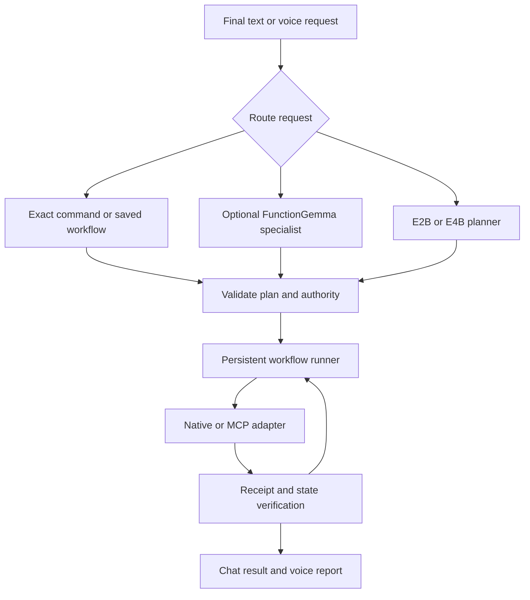

# Jarvis OS V2: tools, workflows, and skills audit

Research date: 2026-09-24. Status: research and proposed design; no runtime feature implementation or model benchmark performed.

Follow-up: the [AppFunctions landscape review](appfunctions-landscape-2026-09-24.md) promotes AppFunctions consumer integration and caller-access validation into the initial tools work, alongside the shared registry and MCP architecture. It updates the integration priorities below with current platform, sample, and early-access findings.

## Recommendation

Build one Kotlin tool runtime shared by chat and voice. Keep the existing V2 execution receipts, strict validation, accepted-action queue, and separation between interrupting speech and cancelling work. Add phone-control adapters from Android Remote Control MCP selectively. Reuse the original Jarvis OS capability registry, operation history, and workflow concepts, redesigning their server dependencies and recovery semantics for Android.

Keep E2B/E4B as the general planner and conversational models. Evaluate FunctionGemma 270M as an optional specialist for a small, stable set of frequent commands. Do not put a second model into every request. A deterministic command or saved workflow should not require another model pass to repeat already-resolved arguments.

A tool performs one operation. A workflow owns a sequence, its dependencies, and its execution state. A skill packages reusable instructions and, optionally, a workflow using tools the user has enabled. MCP is an interface through which tools can be exposed; it does not itself supply planning intelligence or reliable workflow recovery.

## Scope and pinned sources

| Repository | Audited revision | Scope |
|---|---|---|
| [Jarvis OS V2](https://github.com/battlesbudz/Jarvis-OS-V2/tree/33a4ac3f957bc34eb1e1ab93831bc026b049be84) | `33a4ac3f957bc34eb1e1ab93831bc026b049be84` | Audio PR2 and Memory OS V2 were both at this revision when the tools branch was created |
| [Original Jarvis OS](https://github.com/battlesbudz/jarvis-os/tree/d8018e4b4ce263a9d03aef41cb864a66e45e331d) | `d8018e4b4ce263a9d03aef41cb864a66e45e331d` | Main branch: tool declarations, capabilities, workflows, skill storage/loading, Android daemon, policy, MCP client |
| [Android Remote Control MCP](https://github.com/danielealbano/android-remote-control-mcp/tree/16f39717ce0969aa81a4ec132ba1cad861ba46cc) | `16f39717ce0969aa81a4ec132ba1cad861ba46cc` | Main branch: all 57 tool names, key handlers/providers, permissions, manifest, tests and license |

The new branch is `feature-tools`. Git rejects a leading slash, so `/feature-tools` was normalized without changing the requested name otherwise. No PR was opened and no existing branch was merged or advanced by this audit.

The [machine-readable inventory](feature-tools-inventory-2026-09-24.json) lists every tool found by the stated extraction method with pinned source links. Original Jarvis yielded 159 static exported `AgentTool` declarations after excluding a code-generation example string. That is a source inventory, not a claim of 159 registered, configured, working tools. Dynamic MCP discovery, factories, and declarations elsewhere can add tools; account configuration and permissions can remove them. Android MCP's 57 source constants match its documented 57 tools.

This is an architecture and selected implementation audit, not a line-by-line security assessment or an end-to-end certification. The installed Android Control APK version was not inspected, and the phone was not operated.

## 1. What V2 already provides

Relevant source: [actions package](https://github.com/battlesbudz/Jarvis-OS-V2/tree/33a4ac3f957bc34eb1e1ab93831bc026b049be84/app/src/main/java/com/battlesbudz/jarvis/v2/actions), [conversation runtime](https://github.com/battlesbudz/Jarvis-OS-V2/blob/33a4ac3f957bc34eb1e1ab93831bc026b049be84/app/src/main/java/com/battlesbudz/jarvis/v2/conversation/ConversationRuntime.kt), and [acceptance map](https://github.com/battlesbudz/Jarvis-OS-V2/blob/33a4ac3f957bc34eb1e1ab93831bc026b049be84/docs/verification/features.md).

| Existing behavior | Implication for this branch |
|---|---|
| `read_battery`, `set_volume`, `open_app` with real Android executors | Extend the existing dispatcher rather than creating a competing execution path |
| Explicit plans of one to three ordered actions; strict native-call matching | Good foundation for validation, but the English parser and fixed limits are not a general workflow engine |
| Whole-plan validation, executor receipts, stop-on-failure and replay suppression | Preserve these properties as the tool set grows |
| An exact single-app command can already bypass model generation | Add equally bounded fast paths where useful; a small model is not always the fastest option |
| Shared text/voice execution and accepted FIFO work | Keep speech interruption separate from task cancellation; new instructions can queue while earlier work continues |
| Three outstanding accepted requests, each containing up to three actions | This is bounded concurrency/intake, not arbitrary parallel tool execution |
| Memory OS approved context and transcript/receipt persistence | Historical memory must remain context rather than authority to execute a new action |
| LiteRT-LM automatic tool execution disabled | Model-generated calls still pass through application validation |

Current gaps and concrete findings:

1. Conditions such as `if`, `when`, and `after` are intentionally rejected by `ActionTurnPlan`. There are no general typed result bindings, workflow branches, timer/event waits, or persistent workflow definitions in this action path.
2. `AcceptedActionQueue` holds scheduling state in memory. Persisted results do not constitute a durable scheduler that can safely resume unfinished actions after process death.
3. `MobileActionToolDefinitions` advertises optional `open_app.package`, but `NativeActionDecoder.decodeStrict` accepts exactly `app`. A model following the advertised schema can therefore produce a rejected call. Schema, validation, and execution must derive from one contract.
4. `ActionTurnRunner` accepts a `maxModelPasses` constructor parameter, while `runNative` hardcodes `repeat(6)`. Workflow limits should have one enforceable source.
5. There is no current screen-control service or general skills execution layer in this tool path.
6. Upstream Android MCP has `minSdk=33`; V2 has `minSdk=29`. A direct copy would require API guards or a deliberate compatibility decision. Fold 6 can support the newer APIs, but existing API 30 release tests must still work with unsupported capabilities disabled or with justified alternatives.
7. [Android CI](https://github.com/battlesbudz/Jarvis-OS-V2/blob/33a4ac3f957bc34eb1e1ab93831bc026b049be84/.github/workflows/android.yml) matches `feature/**` and checks `feature/` in the job condition. `feature-tools` matches neither. Update both before implementation relies on branch CI. This research commit does not claim a CI run.

FunctionGemma was removed in [commit 5319306](https://github.com/battlesbudz/Jarvis-OS-V2/commit/5319306fea4918f5053a046c4273404cf6d7e642). The removed code included an obsolete two-engine wrapper and a compatibility router that returned “Action decoding is not wired yet.” This history is not evidence that a newly fine-tuned router will be faster or reliable. Do not revert the removal wholesale. The older roadmap and Fold 6 benchmark document contain superseded architecture descriptions; this report treats live code as authoritative.

## 2. What to recover from the original Jarvis OS

### Capability and phone-action architecture

The [capability registry](https://github.com/battlesbudz/jarvis-os/blob/d8018e4b4ce263a9d03aef41cb864a66e45e331d/server/capabilities/registry.ts) groups tools, deduplicates names, tracks integration dependencies, and assembles available tools. Its concepts fit V2: expose only the capabilities available on the current device and needed for the current task.

The [named phone surface](https://github.com/battlesbudz/jarvis-os/blob/d8018e4b4ce263a9d03aef41cb864a66e45e331d/server/agent/androidPhoneRuntimeToolNames.ts) contains 15 operations: app opening, YouTube search, URL opening, screenshot capture, screen-context reading, tapping, typing, swiping, phone keys, waiting for UI, reading/opening notifications, in-app search, notifying the user, and returning to Jarvis.

[Android runtime tools](https://github.com/battlesbudz/jarvis-os/blob/d8018e4b4ce263a9d03aef41cb864a66e45e331d/server/agent/tools/androidAppRuntime.ts) add app-name resolution, permission/capability checks, and observation recording. The broader [operator tools](https://github.com/battlesbudz/jarvis-os/blob/d8018e4b4ce263a9d03aef41cb864a66e45e331d/server/agent/tools/daemonShellTool.ts) include element targeting, field typing, forms, drag, pinch, scrolling, and trained-button lookup. These are valuable UX and test references, but their server/daemon transport and some vision-assisted behavior are not local V2 implementations.

The native [OpHandler](https://github.com/battlesbudz/jarvis-os/blob/d8018e4b4ce263a9d03aef41cb864a66e45e331d/android/app/src/main/java/com/gameplan/daemon/OpHandler.kt) also dispatches files, clipboard, notification replies, SMS, camera, screen recording, location, and wearable operations. Prefer one maintained native implementation per capability rather than copying the multiple daemon source trees in the old repository.

### Workflows and operation history

The original [workflow engine](https://github.com/battlesbudz/jarvis-os/blob/d8018e4b4ce263a9d03aef41cb864a66e45e331d/server/agent/workflowEngine.ts) persists workflow state in Postgres through Drizzle and submits background agent jobs. Its six tools create, run, inspect, pause, resume, and list workflows; creation permits up to 20 steps. Completed outputs feed later step prompts. Four cron tools supply a separate scheduling surface.

Reuse its visible progress, saved outputs, pause/resume vocabulary, and job ownership. Redesign these details:

- Steps are agent prompts with text outputs, not typed Android calls with dependency validation and verified postconditions.
- `onWorkflowJobComplete` receives `_jobId` but does not check it. A Kotlin successor needs attempt IDs and stale-completion fencing.
- Job submission and workflow updates are separate operations. Recovery requires a transactionally recorded dispatch intent and explicit handling of interrupted dispatch.
- Pause allows the current job to finish. Resume selects the next pending step without checking whether the prior job is still running. That is a source-level race concern to test, not a reproduced incident in this audit.
- Failed workflows currently require creating a new one. V2 should offer explicit recovery from a verified checkpoint without replaying successful writes.

The [phone operation store](https://github.com/battlesbudz/jarvis-os/blob/d8018e4b4ce263a9d03aef41cb864a66e45e331d/server/agent/phoneRuntimeOperationStore.ts) stores goals, blockers, next steps, and up to 20 recent events, with a companion resolver for “continue that task.” Reuse that experience, but do not copy its completion heuristic: a successful `android_return_to_jarvis_chat` marks the operation complete. Returning to chat does not prove the user's goal was achieved.

### Skills: three systems, with different semantics

| Old system | Actual behavior | V2 proposal |
|---|---|---|
| DB-backed personal skills | User-created/enabled instructions appended to the prompt | Local, versioned, editable instruction skills with bounded loading |
| `skillWriter` files | Repeated signals trigger generation of `.skill.json`; loaded instructions enter the system prompt | Generate a proposal for review, then activate a pinned version |
| `skillCurator` candidates | Recurring activity produces candidate skills for user review | Reuse the proposal/review concept; run locally or during suitable idle periods |

The [built-in catalog](https://github.com/battlesbudz/jarvis-os/blob/d8018e4b4ce263a9d03aef41cb864a66e45e331d/server/routes/userSkillsCatalog.ts) has 10 instruction skills: Morning Ritual, Finance Awareness, Stoic Guide, Deadline Hawk, Deep Work Mode, Weekly Review, Gratitude Practice, Fitness Check-in, Communication Filter, and Energy Management. They are not 10 executable phone workflows and need not all become V2 defaults.

The [harness](https://github.com/battlesbudz/jarvis-os/blob/d8018e4b4ce263a9d03aef41cb864a66e45e331d/server/agent/harness.ts) loads both file-backed and DB-backed skills. [Skill Writer](https://github.com/battlesbudz/jarvis-os/blob/d8018e4b4ce263a9d03aef41cb864a66e45e331d/server/intelligence/skillWriter.ts) and [Skill Curator](https://github.com/battlesbudz/jarvis-os/blob/d8018e4b4ce263a9d03aef41cb864a66e45e331d/server/intelligence/skillCurator.ts) depend on server storage and routed LLM calls. Port the product concepts, not the cloud dependencies or automatic promotion of learned text to mandatory instructions.

### Broader tools and what stays optional

The inventory covers browser automation, search/research, weather, YouTube/transcription, email/calendar, Drive/documents/PDF/presentations, connected accounts, communication channels, memory, jobs/sessions, code/GitHub/deployment, and workspace tools. Many need internet, credentials, a server, or a desktop. Having their definitions on the phone would not make their implementations run offline.

The old [MCP client](https://github.com/battlesbudz/jarvis-os/blob/d8018e4b4ce263a9d03aef41cb864a66e45e331d/server/agent/mcp/mcpClient.ts) supports stdio and HTTP plus tools, prompts, resources, and notifications. It is a useful contract reference, but the Node subprocess path is not an Android port, and its HTTP handling should not be assumed compatible with every current stateful MCP server. Implement protocol negotiation/session handling against a maintained SDK or explicit conformance tests when adding remote integrations.

## 3. Android Control MCP inventory and reuse plan

The [upstream reference](https://github.com/danielealbano/android-remote-control-mcp/blob/16f39717ce0969aa81a4ec132ba1cad861ba46cc/docs/MCP_TOOLS.md) and source agree on the following 57 tools. Names below omit the common `android_` prefix.

| Group | Count | Operations | Port priority |
|---|---:|---|---|
| Screen | 1 | `get_screen_state` | First |
| System navigation | 6 | `press_back`, `press_home`, `press_recents`, `open_notifications`, `open_quick_settings`, `dismiss_keyboard` | First |
| Touch | 5 | `tap`, `long_press`, `double_tap`, `swipe`, `scroll` | First, prefer nodes where available |
| Gestures | 2 | `pinch`, `custom_gesture` | Later |
| Nodes | 5 | `find_nodes`, `click_node`, `long_click_node`, `tap_node`, `scroll_to_node` | First |
| Text input | 5 | `type_append_text`, `type_insert_text`, `type_replace_text`, `type_clear_text`, `press_key` | First |
| Utilities | 5 | `get_clipboard`, `set_clipboard`, `wait_for_node`, `wait_for_idle`, `get_node_details` | Wait/details first; clipboard opt-in |
| Files | 8 | `list_storage_locations`, `list_files`, `read_file`, `write_file`, `append_file`, `file_replace`, `download_from_url`, `delete_file` | Scoped storage pack |
| Apps | 3 | `open_app`, `list_apps`, `close_app` | Opening/listing first; do not promise closing |
| Camera | 6 | `list_cameras`, `list_camera_photo_resolutions`, `list_camera_video_resolutions`, `take_camera_photo`, `save_camera_photo`, `save_camera_video` | Explicit capture pack |
| Intents | 2 | `send_intent`, `open_uri` | Typed, allowlisted wrappers first |
| Notifications | 6 | `notification_list`, `notification_open`, `notification_dismiss`, `notification_snooze`, `notification_action`, `notification_reply` | Read/open first; writes scoped |
| Location | 1 | `get_location` | Opt-in location pack |
| Sharing | 2 | `get_shared_content`, `share_file_via_web` | Local share intake first; web sharing later |

### The most useful implementation details

Under [services/accessibility](https://github.com/danielealbano/android-remote-control-mcp/tree/16f39717ce0969aa81a4ec132ba1cad861ba46cc/app/src/main/kotlin/com/danielealbano/androidremotecontrolmcp/services/accessibility), the upstream provides a tree parser, element finder, node cache, WebView node reduction, a compact formatter, action execution, and text-input abstractions. These are stronger extraction candidates than importing its full app.

`get_screen_state` combines app/window metadata with compact TSV node descriptions and optional annotated screenshots. It defaults to text; paging uses 200 kept nodes, most ordinary node text is truncated to 100 characters, and screenshots are bounded to 700 pixels. WebView merged content is handled differently. These are useful starting bounds, not proven optimal budgets for Jarvis. Fresh captures refresh node state; subsequent pages represent a snapshot, not a new live capture.

Screenshots and accessibility trees are captured separately, so the source explicitly notes a timing gap. Jarvis should refresh targets before acting, detect window/package/layout changes, and verify the resulting screen. Fold/unfold, rotation, keyboard appearance, and overlays require tests.

The text controller uses Android accessibility input connections and serializes typing at the tool layer. Its Boolean return can mean only that the connection was available, not that the target field accepted text. Readback/postconditions remain necessary. Human-speed typing defaults also add latency independently of model speed; do not carry those delays into every Jarvis text operation.

Tool-level enable/disable controls, storage authorization, typed errors, device-data warnings, privacy filtering, and per-call timing logs are useful references. Current default tool settings are permissive and parse failures can fall back to default settings; Jarvis should grant capability packs explicitly and avoid resetting a broken permission configuration to all-enabled.

Upstream has JVM/integration/E2E sources covering screen/Compose/WebView refresh, typing, file permissions, cameras, and errors. Those are reusable test designs; they were not executed here and do not validate the port.

### Boundaries and pitfalls

- `close_app` calls `killBackgroundProcesses` and returns success without verifying closure. Android 14+ restricts that API to the caller's own processes. This is a concrete mismatch for Fold 6/Android 16; expose Home/Back separately and report only observed results. [Android behavior reference](https://developer.android.com/about/versions/14/behavior-changes-all).
- Accessibility is not root. Protected screens, absent nodes, background launches, lock screens, and revoked permissions can block progress. An accepted gesture is not proof a purchase/message/app state changed.
- UI mutations need one shared execution lock across tasks, not just a typing lock. Reading unrelated data may run concurrently; two tasks must not type/tap into the same foreground screen at once.
- Upstream has a [critical advisory](https://github.com/danielealbano/android-remote-control-mcp/security/advisories/GHSA-v82h-m32h-3j39) for unprotected exported configuration components in versions through 1.9.0, patched in 1.10.0. The audited manifest has DUMP permission gates on the ADB configuration receiver and trampoline. Preserve current fixes and omit debug/admin surfaces from an embedded port where unnecessary. This does not establish the installed APK's version.

### Integration choice

**Recommended product:** embed selected native providers behind a Jarvis adapter. This avoids requiring a second app or a changing tunnel for local phone actions. Extract capabilities in small batches and keep upstream provenance.

**Optional early prototype:** connect Jarvis on the phone to an authenticated MCP server at that same phone's loopback address. No public tunnel is required for this same-device arrangement. The second app must remain available, credentials need secure local storage, and Android networking/lifecycle configuration still needs testing.

**Later extension:** remote MCP client/server support for a desktop or external service. Treat network availability and account access as explicit capability requirements. Do not make local tools depend on Cloudflare/ngrok, OAuth hosting, or an internet endpoint.

## 4. FunctionGemma 270M: likely role and evidence

Google positions FunctionGemma as a function-calling specialization of Gemma 3 270M and a foundation for further task-specific training. Its documented training emphasizes single-turn calls and multiple independent calls; dependent multi-step and multi-turn tasks are not explicitly trained out of the box. [Overview](https://ai.google.dev/gemma/docs/functiongemma), [format and limitations](https://ai.google.dev/gemma/docs/functiongemma/formatting-and-best-practices).

Google's [model card](https://ai.google.dev/gemma/docs/functiongemma/model_card) reports the Mobile Actions fine-tune on an S25 Ultra CPU, four XNNPACK threads, dynamic int8, 512 prefill tokens and 32 decode tokens:

| Published metric | Value |
|---|---:|
| Time to first token | 0.3 seconds |
| Decode | 125.9 tokens/second |
| Model size | 288 MB |
| Peak RSS | 551 MB |
| Mobile Actions evaluation, base → fine-tuned | 58% → 85% |

These are neither Fold 6 measurements nor a matched comparison with V2 E2B/E4B. First-token time is not completed-tool latency. Accuracy on Google's small action dataset is not acceptable evidence for broad unsupervised phone control.

The [Mobile Actions recipe](https://ai.google.dev/gemma/docs/mobile-actions) covers seven specific functions: flashlight on/off, contact creation, email, maps, Wi-Fi settings, and calendar events. It does not supply training for Android MCP's 57 tools, Jarvis's existing schemas, app navigation, or arbitrary workflows. A Jarvis specialist needs its own examples and held-out tests.

| Route | Appropriate role | Tradeoff |
|---|---|---|
| Deterministic parser / saved workflow | Fully specified common commands and previously saved sequences | Lowest inference cost; narrow language coverage |
| E2B directly | General task interpretation and next-step planning | Fewer model handoffs; must measure schema/context cost |
| E4B directly | Optional complex reasoning where it improves success enough | Higher device cost; user-selectable, not a silent forced switch |
| FunctionGemma specialist | Frequent commands in a small fine-tuned vocabulary | Potentially faster; another resident model, fallback cost, training burden |

Recommended routing: exact known command → native plan; eligible specialist command → FunctionGemma if enabled and qualified; other requests → selected general model. All routes emit the same validated plan/call structure. Schema validity alone does not establish correct intent, and a model's self-reported confidence is not an execution permission. On ambiguity, resolve arguments or fall back before any side effect.

Do not routinely run E2B to understand a simple request, then FunctionGemma to reformat it, then E2B to acknowledge success. That can add more work than it saves. Likewise, do not rerun a whole action after a timeout if it may already have executed.

Use FunctionGemma's own template/control tokens and verify its LiteRT bundle with the runtime. Gemma 4 has a different [function-call format](https://ai.google.dev/gemma/docs/capabilities/text/function-calling-gemma4). Keep model adapters separate from the tool contract and prevent tool markup from reaching spoken output.

### Proposed Fold 6 comparison

Compare deterministic baseline, E2B, E4B, and base/specialized FunctionGemma on the same finalized prompts, action schemas, and context. Use at least 200 held-out requests with common single actions, independent multi-actions, result-dependent tasks, ambiguous apps/contacts, malformed arguments, unsupported requests, corrections, and ordinary conversation that must not trigger tools. Include real ASR transcripts, then separately test live voice.

Measure cold and warm runs, p50/p95 time to a validated call, time to verified completion, accuracy of tool/arguments/order, fallback rate, unintended calls, peak memory, thermal behavior, and effect on ASR/TTS responsiveness. Record model artifact/hash, runtime, backend, thread count, schema size, and context size. CPU is a sensible first FunctionGemma baseline; GPU suitability is an empirical question. Test co-resident ASR/TTS/general-model memory, not just the specialist alone.

Proposed adoption gate: a material end-to-end latency improvement on its eligible tasks without reducing verified success relative to the selected baseline, plus zero unauthorized executions in the negative-case suite. Choose numerical product targets before running the comparison; do not choose thresholds afterward to favor one model. No performance win is established by this audit.

## 5. Proposed architecture

Suggested module boundaries, introduced only as needed: tool contracts/registry; Android adapters; workflow persistence/runner; skill catalog/loader; optional MCP transport; model routing/benchmarks. Keep the voice engine independent of executor lifetimes.

Each tool descriptor should contain a stable name/version, typed input/output schema, capability/permission needs, offline/network status, risk and approval policy, timeout, retry/idempotency policy, resource lock, and verifiable postconditions. Generate model declarations from this same contract. Start by registering the existing three tools unchanged in behavior.

The local workflow ledger should hold workflow/task/step IDs, dependencies, resolved inputs, version, attempt ID, authorization scope, status, outputs, receipts, and recovery information. Use transactional local storage such as Room/SQLite. Distinguish planned, queued, running, waiting, awaiting confirmation, succeeded, failed, cancelled, and unknown outcome.

An external UI side effect cannot be atomically committed with the local database. Record dispatch intent first and result afterward. A crash between them leaves an uncertain outcome: inspect state before deciding whether to retry. Do not promise exactly-once execution for an arbitrary screen tap or message send. Use provider idempotency keys when available; use postconditions or user resolution otherwise.

Support sequential steps first, then typed output-to-input dependencies and bounded conditions. Run independent read-only operations concurrently only when they have no conflicting resources. Serialize screen control. Keep model inference bounded by runtime ownership and memory budgets; multiple queued tasks do not imply multiple loaded inference engines.

Voice barge-in should silence speech while accepted work continues. “Cancel that task” targets a task; “stop listening” ends the call according to the existing lifecycle. Pausing a workflow should stop dispatch of new steps while allowing the current synchronous operation to resolve. Already completed effects remain in the history. Report progress and final results in chat even if the user changes surfaces.

For delayed work use Android scheduling primitives according to timing requirements. WorkManager supports persistent deferrable work and is already a V2 dependency; it is not a promise of execution at an exact second. Use exact alarms only for qualifying precise user-facing needs and permissions. UI automation may have to wait for an unlocked, available device. [Android scheduling guidance](https://developer.android.com/develop/background-work/background-tasks/persistent).

### Skills format and context cost

Use `SKILL.md` for discoverable metadata and instructions, with a typed manifest/workflow definition for executable recipes. Declare required tools and versions, permission scopes, network needs, input schema, budgets, provenance/license, examples, and success criteria. Load only selected skill content and relevant tools for the current task, with a safe fallback when routing cannot narrow the set.

[Google AI Edge Gallery's skills guide](https://github.com/google-ai-edge/gallery/blob/main/skills/README.md) provides relevant prior art: text skills, native intents, and JavaScript skills hosted in a WebView. Reuse its metadata/discovery ideas. Begin with instruction skills and approved native tools; JavaScript import needs a separately designed sandbox, restricted bridge/network access, time limits, and provenance review. A `SKILL.md` file cannot create a new Android permission or native capability by itself.

Keep skill updates versioned and reviewable. Learned successful workflows can become proposed skills, but stored screen text, notifications, web pages, memory packets, and third-party skill instructions must never grant new execution authority.

## 6. Implementation order and acceptance

| Stage | Deliverable | Required evidence before expanding |
|---|---|---|
| 0. Contracts and branch CI | Add `feature-tools` to CI trigger and job guard; single schema registry; reconcile `open_app.package`; enforce configured limits | Existing release JVM/native and API 30/35 journeys pass at exact revision; no PR required |
| 1. Phone essentials | Existing tools plus typed URL/settings/alarm/timer/map/contact/calendar draft actions as supported | Correct target/arguments, actual Android result, missing app/permission handling, honest draft versus saved status |
| 2. Screen control | Compact tree, node actions, typing, navigation/waits; screenshot fallback | Read → act → verify on fixture apps; stale nodes, keyboard, rotation and revoked permission; Fold 6 fold/unfold checks |
| 3. Durable workflows | Local ledger, sequential calls, dependencies, pause/resume/cancel, interruption recovery and progress | Process death around dispatch, duplicate ASR/model callbacks, partial failure, voice interruption, recovery without duplicate writes |
| 4. Skills and packs | Enable/disable/import/review/versioning; saved executable recipes | Missing tools fail clearly; injected instructions cannot override permissions; instructions alone cannot claim an action happened |
| 5. Specialist experiment | Optional FunctionGemma adapter, dataset, repeatable benchmark | Matched Fold 6 evidence against E2B/E4B/direct baseline before adopting as a default |
| 6. Expanded integrations | Notifications/replies, scoped files, camera/location, network/MCP services and scheduling | Per-pack permissions, postconditions, network/auth failure recovery and retained results |

Benchmark design and data collection can begin during stages 0–2; FunctionGemma adoption does not block the executor or workflow work. Expand the current three-action limit only after the durable runner and its limits are tested, not by simply increasing a constant.

Native Android [common intents](https://developer.android.com/guide/components/intents-common) can handle many basic functions without a general UI agent. An intent may open a form or another app rather than completing an operation. Receipts must distinguish launched, drafted, committed, and verified states.

Suggested first demonstrations:

1. “Set volume to 25%, open YouTube, and tell me the battery.” Existing capabilities through the new registry, with one receipt per step.
2. “Open YouTube and search for composting.” Use an app intent if supported; otherwise observe, target, type, submit, and verify the result screen.
3. “Read my latest notification and prepare a reply.” Read actual notification data, resolve the reply target, show the draft, then send only within the user's authorized scope.
4. “Save that as my evening routine.” Create a reviewable named workflow, parameterize it, and run it later without replanning the whole sequence.
5. Interrupt a running task with another instruction; the first finishes, the follow-up queues, and both results remain visible. A targeted cancellation stops only the intended unfinished work.

Test layers remain distinct: JVM contracts/state machines; actual Android executors on release emulators; real model-generated calls; physical Fold 6 voice/performance/lifecycle tests. Controlled fake tool calls are useful executor tests but do not prove model tool selection. Preserve the repository's release-only artifact convention and exact-revision evidence.

## 7. Attribution, licensing, and distribution considerations

Android Remote Control MCP's [license](https://github.com/danielealbano/android-remote-control-mcp/blob/16f39717ce0969aa81a4ec132ba1cad861ba46cc/LICENSE.md) is MIT. Preserve its copyright and full license text with copied/substantially adapted code. Add an in-app Open Source Credits entry naming Daniele Salvatore Albano and contributors, link upstream, and record the imported commit, source files, and local modifications in a provenance manifest. The audited license prints the years 2026–2027; preserve upstream text rather than silently editing it. Review dependencies and bundled assets individually when selecting files. This audit imports no implementation code.

The original Jarvis OS has an [MIT license](https://github.com/battlesbudz/jarvis-os/blob/d8018e4b4ce263a9d03aef41cb864a66e45e331d/LICENSE). Preserve notices for reused third-party code within it as well.

FunctionGemma remains under the [Gemma Terms of Use](https://ai.google.dev/gemma/terms), including distribution notices, modified-file notices and use restrictions. Its weights are not covered by Android MCP's MIT license. Review the particular training dataset and model export before distributing a fine-tune; do not assume Gemma 4 and FunctionGemma have identical licensing.

Google Play's [Accessibility API policy](https://support.google.com/googleplay/android-developer/answer/10964491?hl=en) prohibits general autonomous planning/execution through Accessibility, while permitting narrow deterministic rule-based automation; it describes an exception for verified accessibility tools whose core purpose serves people with disabilities. A general voice assistant does not automatically qualify. Keep distribution strategy explicit: a GitHub APK can be the initial development channel, while any Play offering needs a policy-compatible capability design. Sideloading does not remove Android permissions or platform restrictions.

## 8. Decisions and remaining unknowns

No clarification was needed to create the branch or finish the research. Recommended defaults are embedded local phone control, E2B/E4B support preserved, optional specialist benchmarking, native/intents before screen automation, and a first workflow focused on app search plus voice interruption/queueing.

The remaining empirical questions are FunctionGemma's matched Fold 6 speed/accuracy and co-resident memory cost; per-app accessibility coverage; low-API compatibility for upstream components; and process-death recovery behavior after implementation. Optional product choices for the next implementation brief are the first priority workflow and the intended public distribution channel. They do not block the registry and executor foundation.

Validation performed for this research: checked remote branch refs, read pinned source files and current primary documentation, cross-checked the 57-tool count, recorded inventory extraction limits, and checked the resulting documentation diff. No new APK was built, no real-model timing was measured, no phone action was executed, and no runtime tests are claimed.
